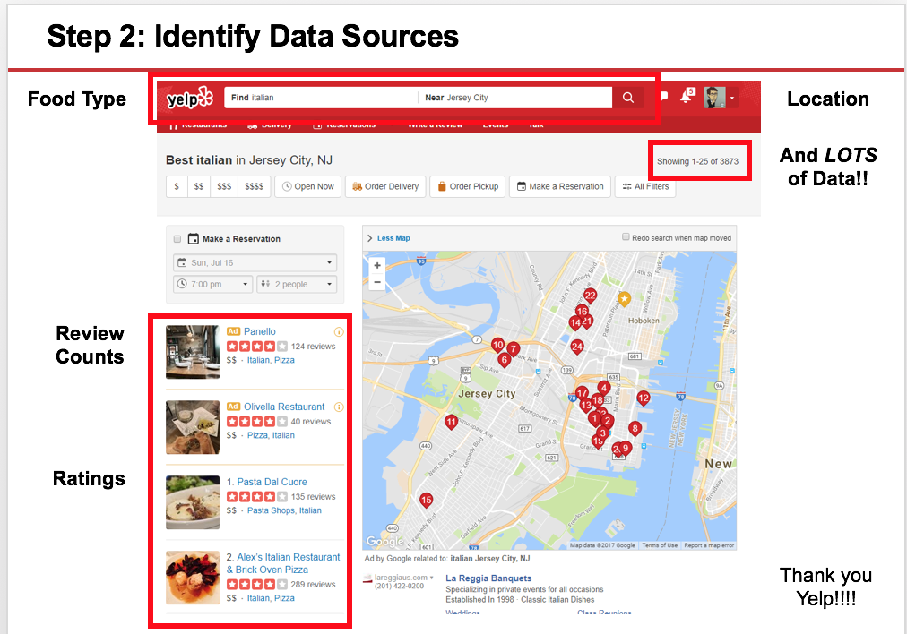
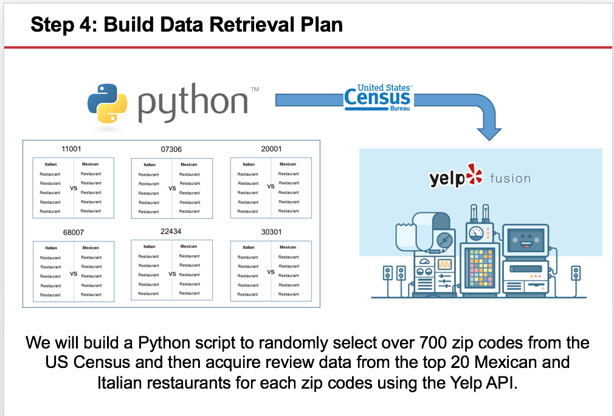
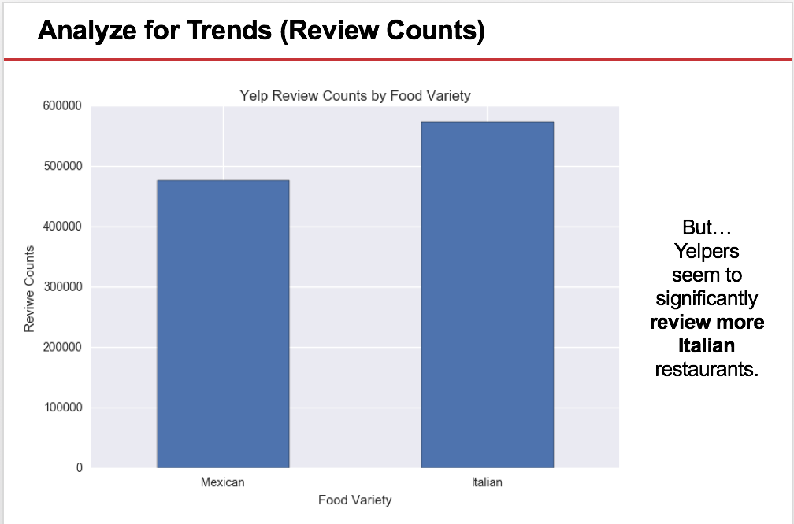
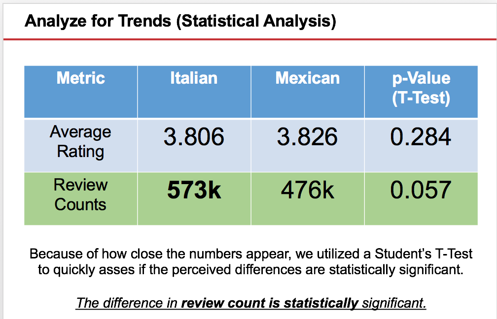
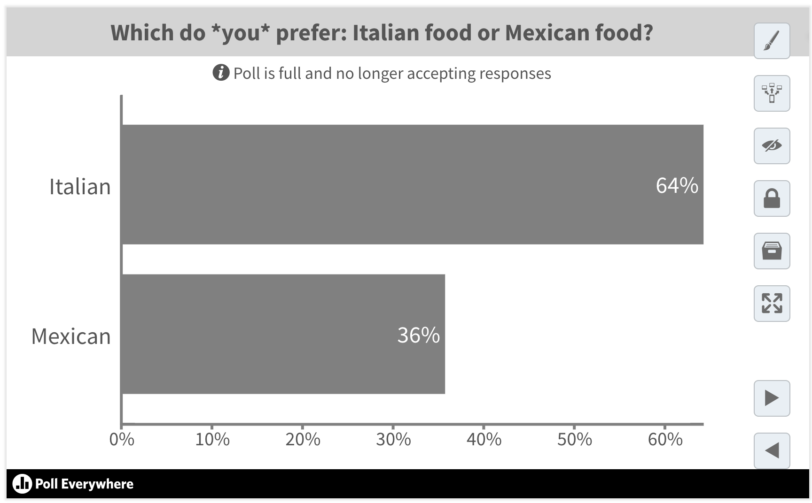

# Breaking Down Thought Experiment #1

* Once the time is up, ask a few groups to present their approaches.

* As students present, try to ask them pointed questions to force them to think even more critically. Occasionally ask other students to weigh in to talk about the strengths and weaknesses of their fellow classmates approaches. (i.e. ask one group to point out the gaps in another group's approach). Be sure to do this in a way that feels communal and supportive.

* Once you've heard a few solutions, flip to the slides where it breaks down our approach to solving the problem. Point out that students should see your explanation as being a taste of what's to come. In essence, we took the following approach:

  * We began by breaking down the phrase: "Americans", "Prefer", "Mexican", and "Italian" to look for a set of quantifiable proxies. In our case, we determined Americans had to be inclusive of both urban and rural locations, and had to be inclusive of the full American landscape. We determined that "preference" could be measured by the number of people who visit Mexican restaurants vs Italian restaurants, and the overall sentiments people express upon visiting those restaurants.

  * We then determined that web services like Yelp and Google Reviews have already collected mountains of this information. Through a service like Yelp it's possible for us to look at the number of reviews and the average ratings for any number of restaurants in nearly every city in America.

  

  * We then determined that we could assemble a large (700+) random sample of zip codes from the US census and use that as a representative sample of American cities.

  * We then used the Yelp API and Python Pandas to programmatically tally the total number of reviews and the average reviews for the top 20 Mexican and Italian restaurants in each of those zip codes.

  

  * We then cleaned and assembled the data to show us comparative information like the overall average rating, total number of reviews, and the number of cities in which one food variety had higher numbers than the other.

  * We then created a set of tables and graphs to visualize this analysis.

  

  * We finally ran a Students T-Test to determine if the differences we saw between the two food varieties was in fact significant.

  

  * Ultimately, we found that in the case of Italian vs. Mexican food the differences are close. Americans rate Italian and Mexican restaurants roughly the same, however, there are more Yelp reviews of Italian restaurants. This may indicate increased preference, but it may also suggest that Italian restaurant attendees are more likely to be Yelp reviewers.

* After you've described the analysis and conclusions, have one of your TA's a quick poll using a website like [Poll Everywhere](https://www.polleverywhere.com/) asking the question: "Which do you prefer Mexican food or Italian food?" With Poll Everywhere it is possible to hide the polling results until you choose to reveal it -- so this should lead to a fun revelation for students.

* See if the results in the class match the analysis -- if they do, celebrate it! If they don't, talk about how data can't answer everything and this is the reality of data analytics. It gets us closer to the truth, but it may not always get us to certainty.

* If time permits, send out a [link](https://github.com/afhaque/Food-Preference-Analysis/blob/master/1-Mexican_vs_Italian/ItalianVsMexican.md) to the markdown version of the Jupyter Notebook provided in the Solved folder. Give students a few moments to look at the code. Let them know that, though it does not make sense today, by the end of the program they will routinely be creating analysis like this one.
