## 2.1 Lesson Plan - VBA Vibes

### Overview

In today's class, students will get their first exposure to fundamental programming in the form of VBA. Today's class will cover basic concepts like variables, arrays, and conditionals -- and serve as the prelude to their future work in Python and JavaScript.

### Class Objectives

* Students will understand the fundamental building blocks of all programming languages: variables, arrays, conditionals, loops, and functions
* Students will understand how to create simple VBA macros to trigger pop ups and change cell values
* Students will gain practice in writing VBA subroutines that utilize variables and conditionals
* Students will begin to develop their essential coding skills of syntax recollection, pattern recognition, problem decomposition, and debugging

### Instructor Notes

* Today's class marks students first foray into fundamental programming. It is critical that you stress to students that what makes this week valuable isn't the VBA syntax, but rather the fundamental concepts they'll be learning that apply across all programming languages.

* If you are new to VBA, don't fret. VBA syntax is fairly easy to pickup and the language is extremely similar to most fundamental programming languages. If anything, VBA is a simple first language to learn, as it combines basic programming tools with a GUI interface and familiar spreadsheet manipulation methods. By the end of the week, you and your students will likely be surprised by how fun writing VBA code truly is.

* Take some time before class to familiarize yourself with the exercises contained in this unit. More importantly, practice your work flow before class. It can be tricky at first knowing how to navigate between the VBA code and Microsoft Excel. We suggest keeping your activities folder open in your IDE. (Be sure your IDE has VBS syntax highlighting). As class progresses, show students the VBA code in your IDE, before opening it in Microsoft Excel and running the script. This may be helpful to students as Microsoft Excel has limited zoom capabilities in its VBA editor. Take advantage of your IDE to provide students with a more legible display.

* Pay close attention to time today. There are many "mini-exercises" in today's class and it can get easy to lose time in the shuffle. If necessary, feel free to cut the last conditional exercise and share it with students to look over on their own.

* Have your TAs refer to the [Time Tracker](TimeTracker.xlsx) to stay on track.

### Sample Class Video

* To view an example class lecture visit (Note video may not reflect latest lesson plan): [2.1 Class Video](https://codingbootcamp.hosted.panopto.com/Panopto/Pages/Viewer.aspx?id=d19082cf-e9cd-48ed-a545-42f26ee0f394)

- - -

### 1. Instructor Do: VBA VIBES PPT (0:15)

* **File**: [vba_vibes.pptx](VBA_VIBES.pptx)

* Begin class, by welcoming students back and entering into the PowerPoint presentation for the day. For some of your students, this will be their first primer into the world of programming. For these students, use the slides as a starting point to introduce the concepts of Variables, Arrays, Functions, Loops, and Conditionals. Don't spend too much time belaboring syntax (in fact avoid conversations on the subject until you begin the code demonstrations), but rather focus on the _concepts_ and _capabilities_ during your presentation. They will get plenty of practice writing code themselves after your presentation.

* When prompted have students complete the steps necessary to confirm their activation of the Developer tab in Microsoft Excel. For those students who do not have it activated, have one of your TAs work with them as you proceed.

* Keep a steady watch of your TAs, as you present to ensure you are staying concise and on track with regards to time. Stay concise! Today's class is not about PowerPoint.

* After the presentation, slack out the [Student Guide](../StudentGuide.md) containing this week's objectives.

### 2. Instructor Do: Hello World  (0:08)

* **Files:** [Activities/01-Ins_HelloWorld/Solved/hello_world.xlsm](Activities/01-Ins_HelloWorld/Solved/hello_world.xlsm)

* Once you've completed the PowerPoint, proceed to introduce the first VBA script. Open your VBA Editor and navigate to Module 1. (All examples in this lesson plan and the ones following can be found in Module 1).

  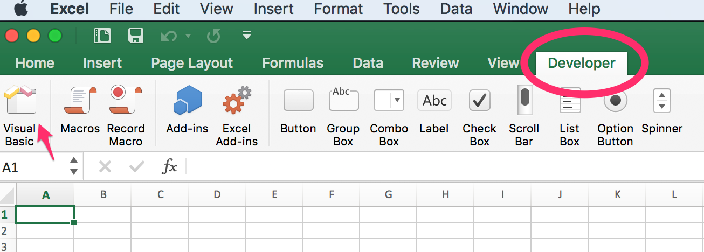

  

* Once inside, walk students through the overall interface. As you do so, explain:

  * That modules represent the applications VBA will be running. These can be created by right clicking on a sheet and then selecting "Insert Module".

  * Once inside a module, we can begin to write out VBA script. In our case, we've pre-created a script that will trigger Excel to deliver a pop-up message.

  * Then hit Play inside your VBA editor to trigger this message.

  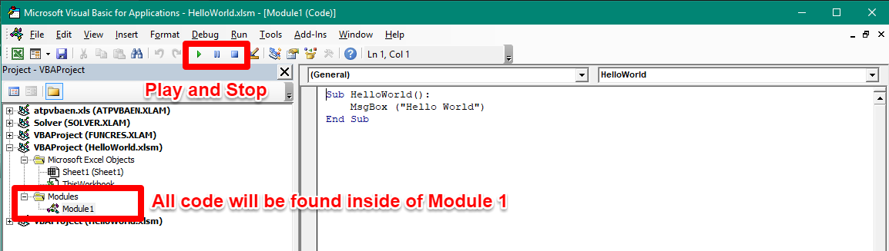

  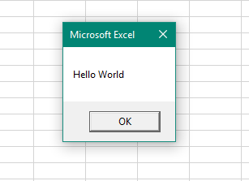

* Once students have seen what the code does, open the [HelloWorld.vbs](Activities/01-Ins_HelloWorld/Solved/hello_world.vbs) script in your IDE. From here, walk students through the key aspects of the subroutine. As you do so, be sure to point out:

  * That the code begins with the keyword `Sub`, which is short for subroutine. This line is followed by `HelloWorld()`, which marks the title of our subroutine. The empty brackets indicate that our subroutine takes in no arguments. (Explain that we'll be talking about functions, which do take in arguments at a later point).

  * Then explain that our subroutine has a single aim -- to create a pop-up message box (`MsgBox`) with the phrase "Hello World".

  * Finally, explain that once our subroutine has triggered its pop-up message, it's work is done and the subroutine completes. This completion is denoted by the `End Sub` keywords. Explain that ever subroutine must begin with the keyword `Sub` and end with the words `End Sub`.

  * Answer any questions that emerge, before proceeding to the next activity.

  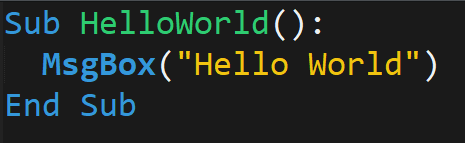

### 3. Students Do: Hello VBA  (0:07)

* **Readme**: [Activities/02-Stu_HelloVBA/README.md](Activities/02-Stu_HelloVBA/README.md)

* Next, open the Excel Sheet found in [Activities/02-Stu_HelloVBA/Solved/hello_vba.xlsm](Activities/02-Stu_HelloVBA/Solved/hello_vba.xlsm) and run the macro.

  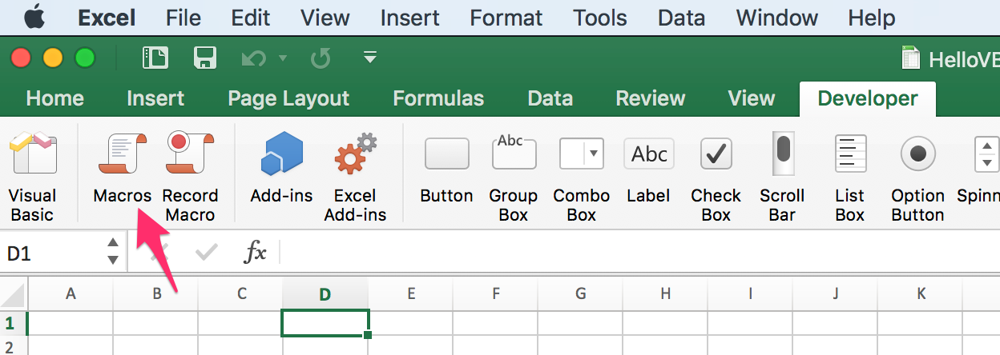

* Show students that three pop-up messages emerge. Then task them with reproducing this effect on their own machines.

* Send the following instructions for them to complete:

  * **Instructions**

    * Create and execute a VBA script that generates three pop-up messages with text contained therein.

    * If you finish early, ensure the people around you complete the task as well.

### 4. Instructor Do: Review Hello VBA (0:05)

* Once the timer is up, open the solution found in [Activities/02-Stu_HelloVBA/Solved/hello_vba.vbs](Activities/02-Stu_HelloVBA/Solved/hello_vba.vbs) and walk students through the code. This exercise simply required creating three sequential message boxes with text inside each.

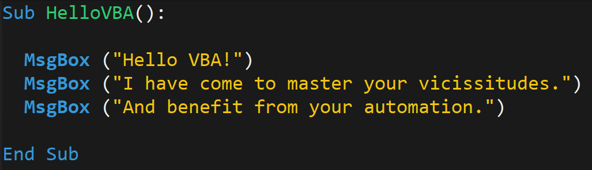

* Ask if there are any questions, before sending the solution and proceeding to the next example.

### 5. Instructor Do: Button Clicks  (0:07)

* **Files**: [03-Ins_ButtonClicks](Activities/03-Ins_ButtonClicks)

* Next, return to the Developer tab to show students how to add a button to their spreadsheet. The Mac view is slightly different, so be sure to patiently support students on both operating systems.

* Once the button is created, you will be asked to "Assign a Macro to the button. You can choose to create a new macro or select a pre-existing one. If you accidentally close this window, you can always return to it by right-clicking your button and selecting "Assign Macro". If you are using the Excel file provided in [03-Ins_ButtonClicks](Activities/03-Ins_ButtonClicks), you will see that the button is associated with a macro that simply prints: "You clicked me" when pressed.


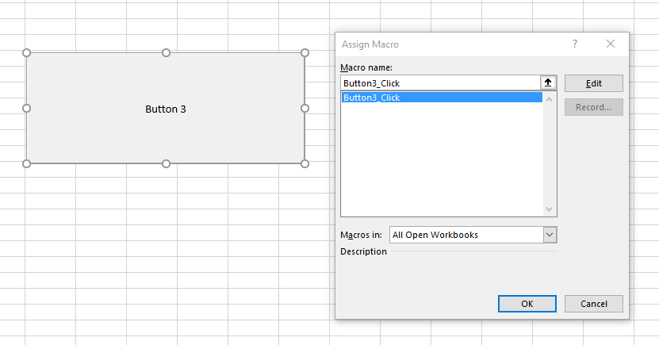
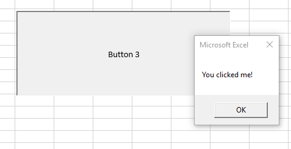

### 6. Students Do: Choose Your Button (0:07)

* **Readme**: [Activities/04-Stu_ChooseYourButton/README.md](Activities/04-Stu_ChooseYourButton/README.md)

* Next, open the Excel file in [Activities/04-Stu_ChooseYourButton/Solved/choose_your_button.xlsm](Activities/04-Stu_ChooseYourButton/Solved/choose_your_button.xlsm) and run the macro. Show students that for the next exercise, they will be running a sub-routine of their own to trigger two buttons that elicit different messages when clicked.

* Send the following instructions for them to complete:

  * **Instructions**

    * Create an Excel file with two interactive buttons. These buttons should each be associated with a different VBA subroutine. When clicked, each button should trigger a different pop-up message.

    * If you finish early, ensure the people around you complete the task as well.

### 7. Instructor Do: Review Choose Your Button  (0:05)

* Once time is complete, open the solution file in [Activities/04-Stu_ChooseYourButton/Solved/choose_your_button.vbs](Activities/04-Stu_ChooseYourButton/Solved/choose_your_button.vbs). Walk students through the VBA script. As you do so, point out:

  * That we created two VBA subroutines, one for each button.

  * Return to the Excel solution file and point out that each button is associated with a different subroutine.

  * Answer any questions, before proceeding to the next example.

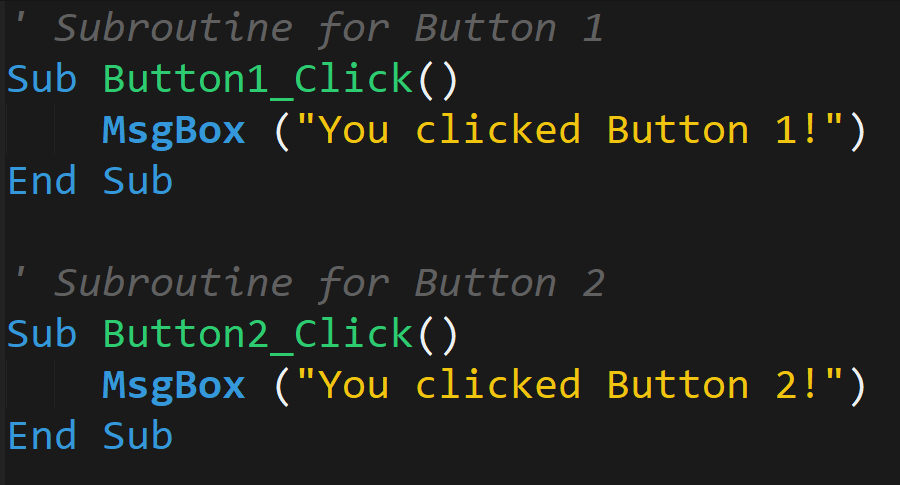

### 8. Instructor Do: Cells And Ranges (0:07)

* Open the files found in [05-Ins_CellsAndRanges/Solved/cells_and_ranges.xlsm](Activities/05-Ins_CellsAndRanges/Solved/cells_and_ranges.xlsm) and run the macro. As you run the macro, explain to students that:

  * VBA provides two primary ways to modify the contents of spreadsheet: `Cells` and `Ranges`.

  * `Cells` provide a numeric coordinate-based method for specifying cells of a spreadsheet. `Ranges` provide a more customary excel-based method for specifying cells of a spreadsheet. Upon running the script, point out to students that `Cells` are organized in a `(Row, Column)` format.

  * `.Value` is a method we add to the end of our `Cell` / `Range` references to specify that we want to change the content value of these cells. This is worth noting, because it will ease their realization that `Cells(X, X)` isn't just capturing the contents of the cell, but rather the entire "Cell Object" -- and with it, the formatting, style, and other aspects of the cell beyond the contents itself.

  * Cells only allow a developer to capture a single cell at a time, while Ranges allow us to capture multiple cells at once. For this reason Ranges are more often used; however, Cells have their use especially in "loop-based" programs because we can iteratively change the integer value of a cell. Let students know that they will get time to work on this concept as the week progresses.

  * Answer any questions that remain, before sending out the .xlsm file to students.


### 9. Students Do: Chess Board  (0:15)

* Next, proceed to the next student example. Open the solution file [Activities/06-Stu_ChessBoard/Solved/chessboard.xlsm](Activities/06-Stu_ChessBoard/Solved/ChessBoard.xlsm) and run the macro. Show students that in this example, they will be populating a chessboard with chess pieces using a combination of `Cells` and `Ranges`.


* Then send students the following:

  * **File:**

    * [ChessBoard.png](Activities/06-Stu_ChessBoard/Images/ChessBoard.png)

    * [ChessBoard_Unsolved.xlsm](Activities/06-Stu_ChessBoard/Unsolved/ChessBoard.xlsm)

  * **Instructions:**

    * Populate the Chess Board provided with text-based chess pieces. For the top-half of the chess board use Ranges, for the bottom-half of the chess board use Cells.

  * **Hint:**

    * Remember that with `Ranges`, it is possible to modify multiple cells at once.

### 10. Instructor Do: Review Chess Board (0:07)

* **File:** [Activities/06-Stu_ChessBoard/Solved/ChessBoard.vbs](Activities/06-Stu_ChessBoard/Solved/ChessBoard.vbs)

* Once time is up, open the solution file and walk students through the code. Begin by running through the `Range` examples for the top cells, before proceeding to the bottom half. In particular, point out how we used the syntax of `Range("A1", "H1")` to place multiple pieces at once.

* As you discuss the solution, look for opportunities to engage students and ask them pointed questions.

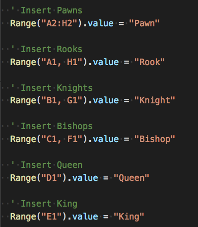
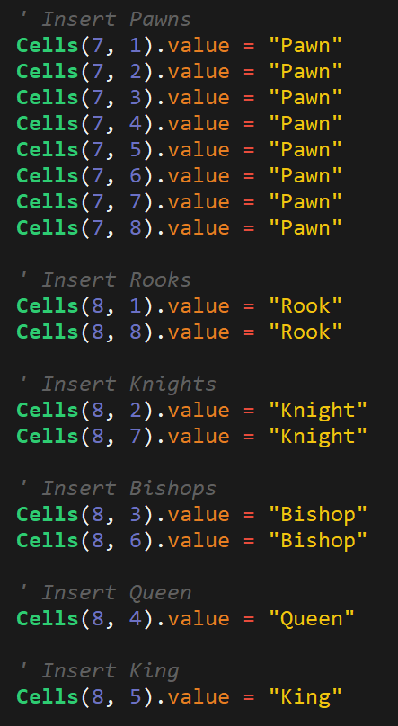

- - -

### 11. Break (0:15)

- - -

### 12. Instructor Do: Variables  (0:07)

* Next, transition to introducing variables. Begin your introduction by reminding students that variables are named items in programming. They can store strings (text), numerics (integers and doubles for decimals), booleans (true/false), and more. Then open the Variables script in [07-Ins_Variables/Solved/variables.vbs](Activities/07-Ins_Variables/Solved/Variables.vbs).

* Walk students through each of the examples:

  * Begin your discussion by breaking down the VBA syntax for creating variables. Explain that we create (declare) variables by using the `dim` keyword followed by the name of the variable and the type `as String`.

  * Point out that we can then utilize these variables using their names.

  * We can "concatenate" strings by combining them together and we can perform mathematical functions by combining numeric variables with operators.

  * We can further use these variables to set the value of our cells.

  * Lastly, we can combine numerics and strings by first "casting" our numerics into string format using the `str()` method. (Similarly, we can cast strings into integers using the `int()` method)

  * See if there any questions, before running the script and proceeding to share it with students.

  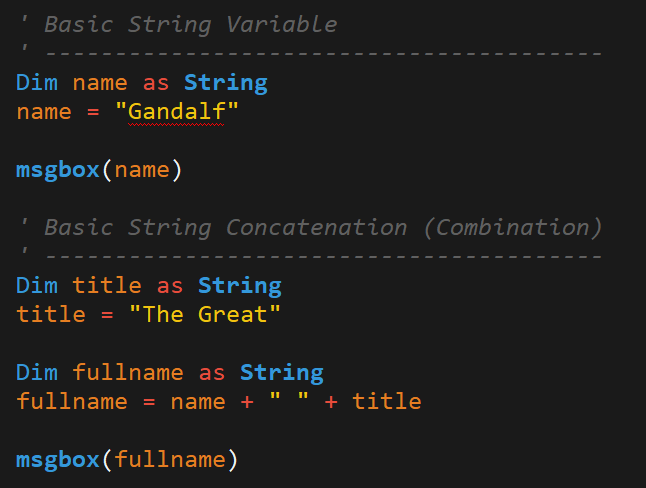

### 13. Students Do: Total Calculator (0:10)

* Next introduce to students the student exercise. For those new to programming, this exercise may be a bit challenging as students are still getting used to flipping between the code examples you provide and their own code editors. Be patient as they establish a rhythm.

* In this exercise, students will create a simple VBA script that takes in user provided Price, Tax, and Quantity values to calculate a total value. They will need to create variables to store these quantities before providing a final output.

* Send out the following to students:

  * **Files:**

    * [TotalCalculator_Unsolved.vbs](Activities/08-Stu_TotalCalculator/Unsolved/total_calculator.vbs)

    * [TotalCalculator_Unsolved.xlsm](Activities/08-Stu_TotalCalculator/Unsolved/total_calculator.xlsm)

  * **Instructions:**

    * Using the Spreadsheet and Unsolved VBS code as a starter, complete the script such that `Price`, `Tax`, `Quantity`, and `Total` are stored in variables.

    * These variables should be then assigned the value of the cell they are associated with in the spreadsheet.

    * When finished, your code should set the `Total` value in the spreadsheet and print a message box with the total in the form of: "Your total is $45.00"

  * **Bonus:**

    * Try to complete the exercise, _without_ looking at the starter code.

### 14. Instructor Do: Review Total Calculator (0:07)

* Once time has elapsed, open the solution inside [Activities/08-Stu_TotalCalculator/Solved/total_calculator.vbs](Activities/08-Stu_TotalCalculator/Solved/total_calculator.vbs). Walk students through the final code. As you do so, point out that:

  * We created a set of variables for `Price`, `Tax`, `Quantity`, and `Total` as `Doubles`.

  * We then used the value of the cells to assign the value of `Price`, `Tax`, and `Quantity`.

  * The code then uses these variables to calculate Total.

  * Lastly, we create message boxes to print the total and set the value of our total cell to be the variable value.

  * Answer any questions that remain before sending students the final solution.

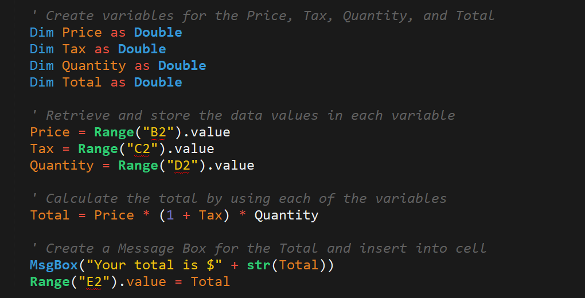

### 15. Instructor Do: Arrays (0:07)

* Proceed to the next example in introducing arrays. Remember to emphasize that the goal of this week for students is _not_ merely to master the syntax of VBA, rather to learn about fundamental building blocks across programming languages. In this case, arrays are an extremely common building block across programming languages.

* Open the script in [Activities/09-Ins_Arrays/Solved/simple_arrays.xlsm](Activities/09-Ins_Arrays/Solved/simple_arrays.xlsm) and walk students through the code. As you do so, point out that:

  * Arrays use zero-based numbering (0-indexed), meaning that the first element is 0. Explain that zero-based numbering is a common paradigm across programming languages (Python, JavaScript, etc.).

  * We created an array called `Ingredients` to hold six strings but because of zero indexing five is passed in. For example (0,1,2,3,4,5) is six spots in the array.

  * We then added elements to this array using the `Ingredients(X)` syntax.

  * We then retrieved these values by referencing our array with the index number.

  * Answer any questions that emerge before sending students this file and proceeding to the next example.

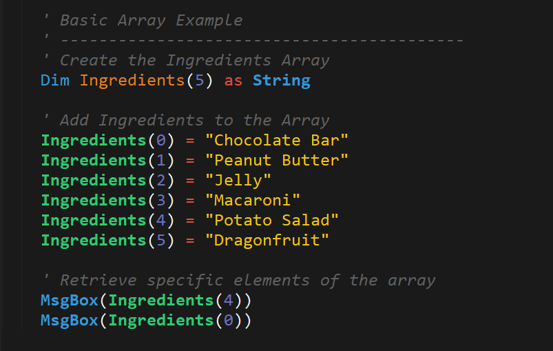

### 16. Instructor Do: Splitting Strings  (0:07)

* **Files**:

  * [Activities/10-Ins_Splitting/Solved/Splitting.xlsm](Activities/10-Ins_Splitting/Solved/Splitting.xlsm)

  * [Activities/10-Ins_Splitting/Solved/Splitting.vbs](Activities/10-Ins_Splitting/Solved/Splitting.vbs)

* This next example is an important one. Here we introduce the `Split` method, which breaks apart strings based on a provided delimiter. These broken down strings then become elements of a larger array.

* In the example provided:

  * A `Words` array is created with an undefined number of string elements.

  * A variable `Shakespeare` is used to hold a line of text.

  * We then use the `Split` method to break apart the `Shakespeare` variable on spaces, creating an array that looks like: `["To", "be", "or", "not", "to", "be", ...]`

  * We can then select individual words from this resulting arrays by referencing the word's index in the array.

  * See if there are any questions before proceeding to the next example.

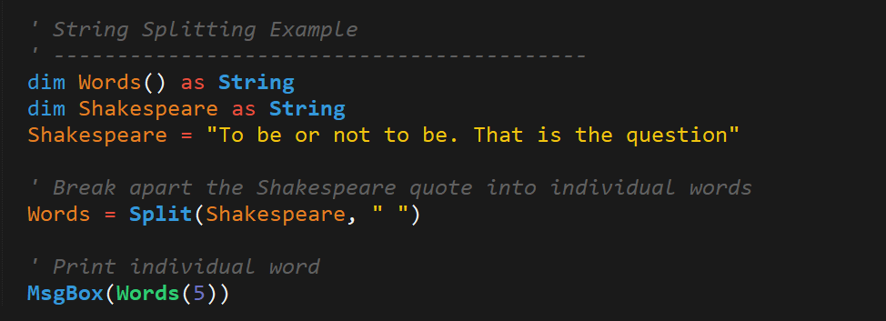

### 17. Students Do: Sentence Breaker (0:20)

* Be prepared. This next exercise is a challenging one! Be sure to walk around and support students in their thinking process. In this exercise, students will be tasked with creating an Excel macro capable of identifying words based on user-provided word numbers. For instance, if a user provides the number 3 for a given sentence of "Any fool can know. The point is to understand", their resulting script should print "can."

* Open the solved Excel workbook [Activities/11-Stu_SentenceBreaker/Solved/sentence_breaker.xlsm](Activities/11-Stu_SentenceBreaker/Solved/sentence_breaker.xlsm), clear out the green boxes, and change the word numbers. Then run the script and show students that the macro "finds" the correct words based on the word number.

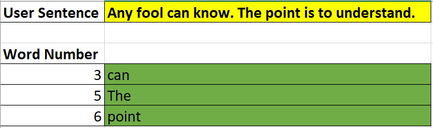

* Then send students the following instructions and files:

  * **Files**

    * [SentenceBreaker.vbs](Activities/11-Stu_SentenceBreaker/Unsolved/sentence_breaker.vbs)

    * [SentenceBreaker.xlsm](Activities/11-Stu_SentenceBreaker/Unsolved/sentence_breaker.xlsm)

  * **Instructions:**

    * Using the files provided as a starting point, create a VBA script such that it reads in a User Sentence then prints the correct words based on word numbers provided.

  * **Notes:**

    * This is a more challenging assignment. So take your time on it. Try to bite it off bit by bit.

### 18. Instructor Do: Review Sentence Breaker  (0:07)

* Once time is complete, open the solution script [Activities/11-Stu_SentenceBreaker/Solved/sentence_breaker.vbs](Activities/11-Stu_SentenceBreaker/Solved/sentence_breaker.vbs). Then walk students through the solution, focusing on four key areas:

  * The first is where we declare and assign a variable to hold our sentence.

  * Next, we declare our variables associated with the word numbers. Each of these is drawn from the cell values where users provide their input.

  * Next, we break apart our sentence into an array using the `Split` method.

  * Lastly, we use the word numbers provided to draw from the sentence array we created. We subtract one from the word number to account for the fact that users will provide word numbers beginning at 1, while our array stores words along the 0th index.

* Once you've broken down the code, send it to students to review. Encourage them to talk it over with the person next to them for the next few moments. Upon completion of their review, see if any new questions emerge.

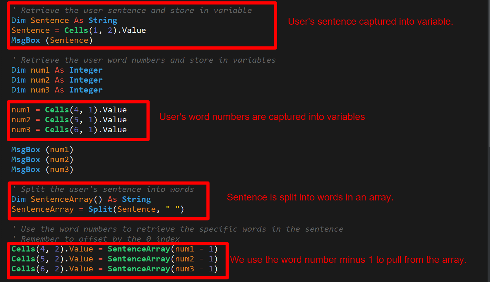

### 19. Instructor Do: Conditionals (0:07)

* Next open the files found in [12-Ins_Conditionals](Activities/12-Ins_Conditionals/Solved). Use these examples to walk students through the concept of conditionals in VBA. As you do so, be sure to point out:

  * That VBA conditionals introduce a real benefit over traditional Excel formulas. Gone are the days of having to squeeze conditionals into a single Excel formula, with VBA comes cleaner syntax and more nuanced conditionals.

  * In VBA, the syntax for conditionals involves: `If` `Then` and `End If`. Additional keywords include `Elseif` and `Else`.

  * In VBA, we can combine conditions using the keywords `AND` and `OR`.

  * Finally, send these files to students so they can reference them for the final example.

```vb
  ' Simple Conditional Example
  ' ------------------------------------------
  If Range("A2").Value > Range("B2").Value Then
      MsgBox ("Num 1 is greater than Num 2")
  End If

  ' Simple Conditional with If, Else, and Elseif
  ' ------------------------------------------
  If Range("A5").Value > Range("B5").Value Then
      MsgBox ("Num 3 is greater than Num 4")

  Elseif Range("A5").Value < Range("B5").Value Then
      MsgBox("Num 4 is greater than Num 3")

  Else
      MsgBox("Num 3 and Num 4 are equal")

  End If
```

### 20. Students Do: Choose Your Story  (0:05)

* **Readme**: [Activities/13-Stu_ChooseYourStory/README.md](Activities/13-Stu_ChooseYourStory/README.md)

* If time permits, begin the final exercise of the day. In this exercise, students are tasked with creating a simple game that outputs a message box based on the user's input number.


* Send the following instructions:

  * **Instructions:**

    * Create a simple Excel workbook and VBA macro in which a user is provided a single button to click. Based on the number they provide in a text box above, a different message box will appear.

      * If the user enters a value of 1, display: "You choose to enter the wooded forest of doom!"

      * If the user enters a value of 2, display: "You choose to enter the fiery volcano of doom!"

      * If the user enters a value of 3, display: "You choose to enter the terrifying jungle of doom!"

      * If the user enters anything else, display: "You decide to stay home instead"

### 21. Instructor Do: Review Choose Your Story (0:05)

* Once time is up, use the solution file found in [13-Stu_ChooseYourStory](Activities/13-Stu_ChooseYourStory) to guide students. Remind students of VBA conditional syntax and walk them through the simple logic.

* Answer any remaining questions, before providing students with the solution.

```vb
  ' Use conditionals to change message box based on user input
  If (Range("B1").value = 1) Then
      MsgBox("You choose to enter the wooded forest of doom!")

  Elseif (Range("B1").value = 2) Then
      MsgBox("You choose to enter the fiery volcano of doom!")

  Elseif (Range("B1").value = 3) Then
      MsgBox("You choose to enter the terrifying jungle of doom!")

  Elseif (Range("B1").value = 4) Then
      MsgBox("You choose to enter the bathroom")

  Else
      MsgBox("Try following directions")

  End If
```

### 22. Instructor Do: Intro Homework Assignment  (0:00)

* With whatever time remains in class, briefly introduce students to this week's homework. In essence, the homework assignment tasks them with creating a VBA script to loop through stock market records to identify various stocks based on provided conditions. Let them know that they will be able to complete the homework by the end of Saturday's class.

* Wish them well and then close out class!

- - -

### LessonPlan & Slideshow Instructor Feedback

* Please click the link which best represents your overall feeling regarding today's class. It will link you to a form which allows you to submit additional (optional) feedback.

* [:heart_eyes: Great](https://www.surveygizmo.com/s3/4381674/DataViz-Instructor-Feedback?section=vba-day-1&lp_useful=great)

* [:grinning: Like](https://www.surveygizmo.com/s3/4381674/DataViz-Instructor-Feedback?section=vba-day-1&lp_useful=like)

* [:neutral_face: Neutral](https://www.surveygizmo.com/s3/4381674/DataViz-Instructor-Feedback?section=vba-day-1&lp_useful=neutral)

* [:confounded: Dislike](https://www.surveygizmo.com/s3/4381674/DataViz-Instructor-Feedback?section=vba-day-1&lp_useful=dislike)

* [:triumph: Not Great](https://www.surveygizmo.com/s3/4381674/DataViz-Instructor-Feedback?section=vba-day-1&lp_useful=not%great)

- - -

### Copyright

Trilogy Education Services © 2018. All Rights Reserved.
