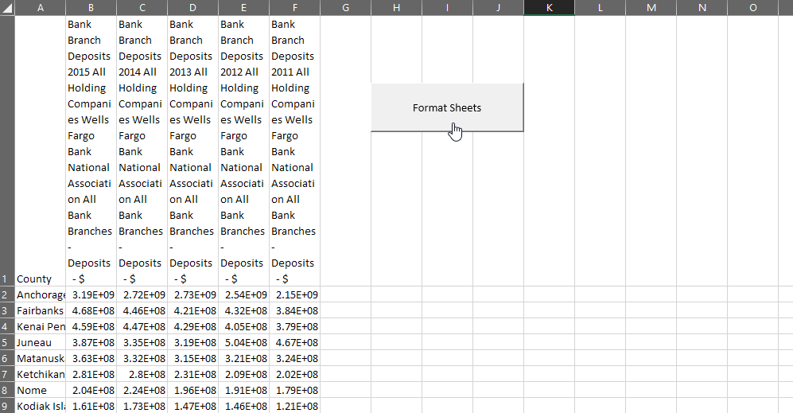
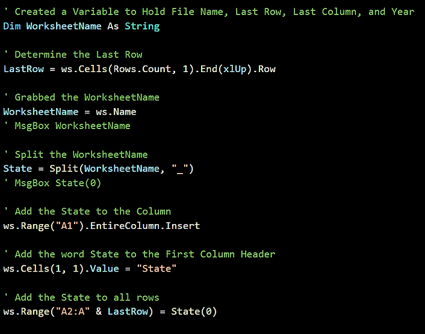
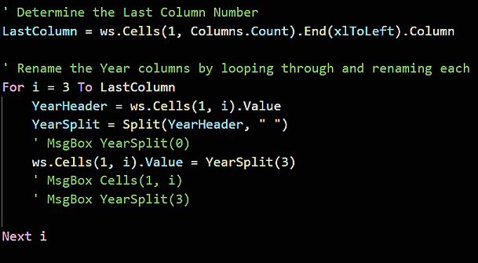

## 2.3 Lesson Plan - Getting Real with VBA

### Overview

Today will complete this in-depth week on VBA scripting with VBA Formatting and loops. During the second half of class, there will be a short project for students to work on.

### Instructor Notes

* In preparation for 3.1, TAs should use today to confirm each student's Python environment. The installation for Python will generally lead to a few issues, especially for Windows users. To help minimize this, students will be given the installation guide at the beginning of class. Ask that they confirm their install with a TA during the break or office hours today. A standard issue will be the lack of PATH variable set for Anaconda.

* Students will spend much of today's class working in groups on a small-scale project that goes over everything that they have learned thus far. While this activity may be challenging, it will be a good indicator of how well the students will be able to handle this week's homework.

* Coding can be stressful and many of your students may be feeling the pressure of learning so much in such a short amount of time. Keep them confident and motivated. Make jokes and try to keep them smiling. One of the critical facets of programming is perseverance. Any code will function eventually so long as you keep at it.

* This lesson marks the first time we will be offering students a significant portion of the class to complete a small-scale project. As such, make sure to set concrete stopping points where you bring everyone in the class back together to go over individual parts of the code. This ensures no student or group is left behind even if they are struggling.

### Sample Class Video

* To view an example class lecture visit (Note video may not reflect latest lesson plan): [2.3 Class Video](https://codingbootcamp.hosted.panopto.com/Panopto/Pages/Viewer.aspx?id=720d3727-1aa5-4620-a461-888d56fe0152#)

- - -

### Class Objectives

* Students will be comfortable formatting spreadsheets using VBA code

* Students will understand how to loop through a table using VBA code and check for changes in values

- - -

### 01. Instructor Do: Welcome Students and Pep Talk (0:15)

* Welcome your class to their final day of VBA.

* Before you begin class slack out [Conda_Installation.md](../../../00-Prework/docs/modules/Conda_Installation.md) to make sure their Python environment is installed before the start of next class.

  * To verify if the installation of the Python environments, students can type into their terminal or git-bash:

  ```sh
  conda list -n pythondata | grep jupyter
  ```

  * Ask students to find a TA before they leave for the day and verify that their Python environment is ready for the next class.

  * Ask students to seek out a TA during the break or office hours if they have any installation issues.

  * Ensure that there will be time to work through this during the break, so they shouldn't worry about it during the VBA activities.

* Your students have likely noticed how this unit has been far more challenging than the previous one. They may even be feeling a little stressed out or frustrated. Let them know that everything is going to be okay. For many of them, this week marks their first foray into programming and no one expects perfection on the first go. Reassure them that, so long as they put in the hours of practice and never give up hope, they will come out of this week with a strong understanding of basic programming.

* Open the [Victorious_VBA.pptx](Victorious_VBA.pptx) and go through the slides. Along the way explaining:

  * _Slides 3-4_ programming takes time to learn and trying to learn everything at the last minute is tough. Be sure that they are studying correctly and if something takes too long ask for help.

  * _Slides 9-14_ have students try to explain to you what a for loop does. Use the following slides to give a visualization of how a for loop works.

  * _Slides 16-23_ do the same for a nested for loop.

  * Finally, end with any open questions.

### 02. Students Do: Stars Counter (0:15)

* Start today's class off with a short warm-up and review of what we covered during our last two meetings.

* We'll be slacking out to students an Excel spreadsheet containing 50 rows of "review data" for Spanish and French online language programs. Using their knowledge of VBA, it is up to them to determine the total number of stars each user gave their respective programs and then find the total number of stars both programs received.


* **Files**

  * [StarCounter_Unsolved/star_counter.xlsm](Activities/01-Stu_StarsCounter/Unsolved/star_counter.xlsm)

* **Instructions**

  * Create a VBA Script that tallies the number of "Full Stars" per row and enters them into the Total column. Starter Code is provided, but feel free to start from scratch if you want an extra challenge :-)

* **Bonus**

  * Instead of hard-coding the last number of the loop, use VBA to determine the last row automatically (i.e. do not use for i = 2 to 51)

  * Create two charts:

    * One to see if there is a relationship between Program Type and Rating (Bar Chart)

    * The other to see if there is a relationship between Date and Rating (Line Graph)

* **Hints**

  * You will need to use a nested for loop.

  * You will need to create a variable to hold the number of stars and continually reset this variable at the start of each row.

### 03. Instructor Do: Review Star Counter (0:05)

* Open up [01-Stu_StarsCounter/StarCounter_Solved_WithVBA](Activities/01-Stu_StarsCounter/Solved/star_counter_with_VBA.xlsm) and run through the code with your class, fielding whatever questions they may have.

* In your discussion of the basic solution make sure to point out the following:

  * The code loops through rows 2 to 51 in our first loop

  * It then loops through columns 4 to 8 for that row within the second loop

  * Every time we find a "Full-Star" value within a column, we add one to our `StarCounter`

  * The value of `StarCounter` is placed within a new cell after the conclusion of the second loop and then we move onto the next value in the first loop

  

  * To count all of the stars on the page, all that needs to be added is another variable, add to it just like `StarCounter`, and then not reset it on each new row.

### 04. Instructor Do: VBA Formatting (0:05)

* Not only can we use VBA to change the values within cells, but we can also code in formatting fairly easily using a variety of functions.

  

* Open up [02-Ins_Formatter/formatter.xlsm](Activities/02-Ins_Formatter/Solved/formatter.xlsm) within Excel and explain to your students how we will be using VBA to fill each of these cells with their respective colors.

  * Within the VBA editor, write the following code...

  

* Check with to see if your students can guess what this code will do when run.

  

  * The text in cell A1 will be colored red

  * The interiors of cells A2 to A5 will be filled with red as well

  * Your students may be wondering where we got the value "3" from and how it corresponds to the color red... And the answer is that Excel has split its palette up into 56 colors and given each of them a corresponding numeric value. Your students can find a handy-dandy chart for these values by following [this link](http://dmcritchie.mvps.org/excel/colors.htm).

* Now that your students have a guide to the colors, have them help you create the code that will color columns B, C, and D.

  

  * Point out how the code is mostly the same as painting the cells red with the only values changing being the cells referenced and the color value.

* Check with your students to see if they have any questions regarding VBA formatting before moving onto the next activity.

### 05. Students Do: VBA Grade Book (0:15)

* Now your students are going to create an Excel application that checks a fictional student's grade and performs some actions based upon it.

  

* Once you have shown your students an example of how this application will function, slack out the starter file and instructions.

* **Files**

  * [GradeBook_Unsolved/grader.xlsm](Activities/03-Stu_Gradebook/Unsolved/grader.xlsm)

* **Instructions**

  * Using `grader.xlsm` as a starting point, create a grade calculator using **conditionals**. This calculator will convert a student's numeric grade into a letter grade, and style the resulting cell accordingly.

  * Once complete your script should perform the following:

    * If the score is over 90, the student will receive an "A" in the letter grade cell, and the Pass/Warning/Fail cell will be filled green with the text "Pass."

    * If the score is between 80 and 89 (inclusive), the student will receive a "B" in the letter grade cell, and the Pass/Warning/Fail cell will be filled green with the text "Pass."

    * If the score is between 70 and 79 (inclusive), the student will receive a "C" in the letter grade cell, and the Pass/Warning/Fail cell will be filled yellow with the text "Warning."

    * Finally, if the score is below a 70, the student will receive an "F" in the letter grade cell, and the Pass/Warning/Fail cell will be filled red with the text "Fail."

* **Bonus**

  * Create a second button that resets the grades to the original state and then establishes the previous grade in a row labeled "Last Grade."

### 06. Instructor Do: Review Grade Book (0:05)

* Open up [03-Stu_Gradebook/graderSolved.xlsm](Activities/03-Stu_Gradebook/Solved/grader.xlsm) and run through the code with your class, fielding whatever questions they may have.

* In your discussion of the solution make sure to point out the following:

  * Point out how you are modifying the formatting/value of cells B2/C2 based upon the value stored within A2. When the value of A2 changes, so too does the formatting/value of cells B2/C2.

  * Due to the number of possible inputs, our code includes plenty of conditionals to account for every new letter grade.

  * For the bonus, the code only needs to collect the previous values of A2, B2, and C2 before moving them into three new cells, then clear the information held in row 2.


### 07. Partners Do: Checkerboard (0:15)

* While this next activity does involve VBA formatting, the core goal is to help teach students coding logic.

* Students must create an 8x8 checkerboard pattern using nothing but VBA scripts. This means creating a script which formats cells based upon whether they are determined to be even or odd. Open [04-Stu_Checkerboard/checkerboard_solved.xlsm](Activities/04-Stu_Checkerboard/Solved/checkerboard.xlsm) and demo what the solution should look like.

  

* **Instructions**

  * Using VBA scripts, create an 8x8 grid with alternating red and black squares.

* **Hints**

  * You will need to use nested for loops, conditionals, mods, and formatting to create the board.

  * This is a tricky problem! Try to pseudocode a plan first.

    * Unlike previous activities, this activity can be solved in a multitude of different ways. While some methods may be more efficient than others, simply finding a solution to the problem is a great start!

### 08. Instructor Do: Review Checkerboard (0:05)

* Open up the [04-Stu_Checkerboard/checkerboard_solved.xlsm](Activities/04-Stu_Checkerboard/Solved/checkerboard.xlsm) of the previous activity and run through the code with your class, fielding whatever questions they may have.

* While discussing this activity's solution, make sure to cover the following:

  * This solution is not the "correct" or even the "optimal" means by which we can solve this problem. Check in with students regularly to see how they solved it differently.

  * This solution uses two for loops, a variable, and an if/else conditional.

  * With each iteration of our loops, the variable goes up by one.

  * If the variable is even, the cell is formatted to be black. Otherwise, it is formatted to be red.

```vb
Sub CheckerBoard()

  ' Setup a counter to track cell number
  Dim cellnumber as Integer
  cellnumber = 1

  ' Loop through each row of the board
  For i = 1 to 8

    ' Loop through each column of the board
    For j = 1 to 8

      ' If we are on a cell that is divisible by 2 then color it black
      If (cellnumber mod 2 = 0) then

        Cells(i, j).Interior.ColorIndex = 1

      ' Otherwise color it red
      Else

        Cells(i, j).Interior.ColorIndex = 3

      End if

      ' Add one to our cell number each time
      cellnumber = cellnumber + 1

    Next j

    ' Whenever we start on a new row, we also add one to the cell number (to create the alternation)
    cellnumber = cellnumber + 1

  Next i

End Sub
```

### 09. Instructor Do: Looking to the Next Cell (0:05)

* When looping through rows and/or columns, it sometimes becomes necessary to check for changes and then run some alternative code based upon those changes.

  * A good example of this would be when you want to count how many rows contain a specific value and compare it to another series of rows containing a separate value.

* Open up [05-Ins_NextCells/NextCells.xlsx](Activities/05-Ins_NextCells/Solved/next_cells.xlsx) and copy the code from [05-Ins_NextCells/NextCells.vbs](Activities/05-Ins_NextCells/Solved/next_cells.vbs) into the VBA editor.


* Run through the code with your students.

  * Make sure to point out how we are looping through the rows in the first column and printing a message to the screen whenever the value changes from one row to the next.

  * Feel free to change the column variable to 2 and then 3 to show students how this code is checking for changes in relation to the previous value. (Texas v New York, New York v Nebraska, Nebraska v Texas)

* Answer whatever questions your students may have before moving onto the next activity.

### 10. Students Do: Card Checker (0:20)

* The primary purpose of this activity is to solidify the necessity of checking for changes in cell values and performing calculations whenever those changes occur.

* In this next activity, students will be using a VBA script to create a summary table based upon a series of values stored within an Excel spreadsheet.


* Once you have shown your class what they will be working to accomplish, slack out the instructions and data for this activity.

* **Files**

  * [06-Stu_CreditCardChecker/credit_charges.xlsm](Activities/06-Stu_CreditCardChecker/Unsolved/credit_charges.xlsm)

* **Instructions**

  * Create a VBA script that will process the credit card purchases, identifying each of the unique brands listed.

  * For the _Basic_ assignment, create a single pop-up message for each of the Credit Card brands listed by looping through the list.

  * For the _Advanced_ assignment, tally the total credit card purchases for each Credit Card brand and add it to the summary table.

### 11. Instructor Do: Review Card Checker (0:10)

* Open up [06-Stu_CreditCardChecker/credit_charges.xlsm](Activities/06-Stu_CreditCardChecker/Solved/credit_charges.xlsm) and run through the code with your class, fielding whatever questions they may have.

* Key points to cover in your review of this activity:

  * The code loops through all of the rows containing credit card purchases.

  * The code then checks for times where the contents of a cell in column A do not match the contents of the cell in the next row down.

  * Whenever the contents of the two cells do not match, we print the contents of the first cell to the screen before continuing on.


* Key points to cover from the advanced solution:

  * The code is very similar to the basic solution. The main difference is that it is now adding to the `Brand_Total` variable whenever a different value in column A is not found.

  * Whenever a change is found, the application will the values of the final row to the total before placing the `Brand_Name` and `Brand_Total` into a summary table.

  * There is also a variable called `Summary_Table_Row` which keeps track of what row we should print the next line of data into so that there is no overwriting.


- - -

### 12. BREAK (0:40)

- - -

### 13. Instructor Do: Wells Fargo Setup (0:05)

* For the rest of class, students will get into small groups to create a VBA script that takes an unmodified Excel workbook with several sheets of Wells Fargo data, formats each sheet so that they are more readable, and then combine all of the data into a single table.

* Students should place one member of their group in charge of writing the code out so that they all work on the same workbook. This also ensures they are all moving at the same pace and work together on the assignment.

* Let students know that this activity will be split into individual parts and that the class will be coming back together to review once each part has been completed.

### 14. Groups Do: Wells Fargo - Part I (0:30)

* Open up the unsolved version of the data to show the class how it looks.

  * This data is pretty raw and is not entirely easy to read. As such, students will start out by creating a VBA script that loops through each worksheet in our workbook and formats them to be far more readable.



* It is recommended that students create code that formats a single sheet first and then, once this has been accomplished successfully, modifying the code to loop through and modify each worksheet within the workbook.

* Once you have answered whatever questions your students may have, slack out the following...

* **Files**

  * [Activities/07-Stu_WellsFargo_Pt1/combined_wells_fargo.xlsm](Activities/07-Stu_WellsFargo_Pt1/Unsolved/combined_wells_fargo.xlsm)

* **Instructions**

  1. Extract words before the phrase "\_Wells_Fargo" to figure out which State.

  2. Add the State to the first column of each spreadsheet.

  3. Convert the headers of each row to simply say the year.

  4. Convert the numbers to currency values for all cells

* **Hints**

  * First work on getting the correct formatting on one sheet before moving onto creating a loop that formats each sheet within your workbook.

  * If you are looking for a useful resource for finding the code to loop through all worksheets in a workbook, check out this link [here](https://support.microsoft.com/en-us/help/142126/macro-to-loop-through-all-worksheets-in-a-workbook)

### 15. Instructor Do: Review Wells Fargo - Part I (0:10)

* Open up [07-Stu_WellsFargo_Pt1/wells_fargo_format_pt1.xlsm](Activities/07-Stu_WellsFargo_Pt1/Solved/wells_fargo_format_pt1.xlsm) and run through the code with your class, fielding whatever questions they may have.

* Some key points to go over in the code:

  * To loop through all worksheets using VBA we use a `For Each` loop that loops through the built-in array of `Worksheets`

  

  * To collect the state's name, the code looks at the name of the current worksheet - `ws.Name` - and then splits on underscores. It can then place the name alone by referencing `State(0)` since the state name is stored at index 0 in the `State` array.

  

  * To collect/convert the years for the sheet's columns, the code finds the final column, loops through columns 3 to the final column, splits the contents into spaces, and then places the value at index 3 into the cell.

  

  * Finally, to add the currency number format to our dataset, all the code needs to do is loop through all of the rows/columns from B2 onwards and apply the style of "Currency"

  

* Slack out the code for this part of the activity so that groups that may have fallen behind can move onto part II of the project.

### 16. Groups Do: Wells Fargo - Part II (0:28)

* In this second part of the project, students will be combining all of their previous sheets into one massive table on a new sheet.

  * This will require them to loop through each sheet, select each row of data, and move them into the new sheet.


* When you have shown off the solved version of the activity, slack out the following.

* **Files**

  * [08-Stu_WellsFargo_Pt2/wells_fargo_format.xlsm](Activities/08-Stu_WellsFargo_Pt2/Unsolved/wells_fargo_format.xlsm)

* **Instructions**

  1. Loop through every worksheet and select the state contents.

  2. Copy the state contents and paste it into the Combined_Data tab

### 17. Instructor Do: Review Wells Fargo - Part II (0:10)

* Open up [Activities/08-Stu_WellsFargo_Pt2/combined_wells_fargo2.xlsx](Activities/08-Stu_WellsFargo_Pt2/Solved/combined_wells_fargo2.xlsm) and [08-Stu_WellsFargo_Pt2/wells_fargo_ptII.vbs](Activities/08-Stu_WellsFargo_Pt2/Solved/wells_fargo_ptII.vbs) and combine them into one file. Now run through the combined solution with your class, fielding whatever questions they may have.

* The key points to cover in this part of the activity:

  * The code sets a variable to the location of the "Combined_Data" worksheet inside of the workbook. If this sheet has not been created, the code should return an error.

  * Once again utilizing a `For Each` loop to move through each worksheet in the workbook.

  * Finds the final row on each sheet and then collects all of the data on those sheets before transplanting it into the combined sheet.

```vb
Sub WellsFargo_PtII()

    ' Add a sheet named "Combined Data"
    Sheets.Add.Name = "Combined_Data"
    'move created sheet to be first sheet
    Sheets("Combined_Data").Move Before:=Sheets(1)
    ' Specify the location of the combined sheet
    Set combined_sheet = Worksheets("Combined_Data")

    ' Loop through all sheets
    For Each ws In Worksheets

        ' Find the last row of the combined sheet after each paste
        ' Add 1 to get first empty row
        lastRow = combined_sheet.Cells(Rows.Count, "A").End(xlUp).Row + 1

        ' Find the last row of each worksheet
        ' Subtract one to return the number of rows without header
        lastRowState = ws.Cells(Rows.Count, "A").End(xlUp).Row - 1

        ' Copy the contents of each state sheet into the combined sheet
        combined_sheet.Range("A" & lastRow & ":G" & ((lastRowState - 1) + lastRow)).Value = ws.Range("A2:G" & (lastRowState + 1)).Value

    Next ws

    ' Copy the headers from sheet 1
    combined_sheet.Range("A1:G1").Value = Sheets(2).Range("A1:G1").Value

    ' Autofit to display data
    combined_sheet.Columns("A:G").AutoFit
End Sub
```

### 18. Instructor Do: Video Guide and Close Class (0:02)

* Before finishing up for the night, slack out the [Video Guide](../VideoGuide.md) containing walkthroughs of this week's key activities. Encourage students to review them later and utilize office hours if they have further questions.

- - -

### LessonPlan & Slideshow Instructor Feedback

* Please click the link which best represents your overall feeling regarding today's class. It will link you to a form which allows you to submit additional (optional) feedback.

* [:heart_eyes: Great](https://www.surveygizmo.com/s3/4381674/DataViz-Instructor-Feedback?section=vba-day-3&lp_useful=great)

* [:grinning: Like](https://www.surveygizmo.com/s3/4381674/DataViz-Instructor-Feedback?section=vba-day-3&lp_useful=like)

* [:neutral_face: Neutral](https://www.surveygizmo.com/s3/4381674/DataViz-Instructor-Feedback?section=vba-day-3&lp_useful=neutral)

* [:confounded: Dislike](https://www.surveygizmo.com/s3/4381674/DataViz-Instructor-Feedback?section=vba-day-3&lp_useful=dislike)

* [:triumph: Not Great](https://www.surveygizmo.com/s3/4381674/DataViz-Instructor-Feedback?section=vba-day-3&lp_useful=not%great)

- - -

### Copyright

Trilogy Education Services © 2018. All Rights Reserved.
