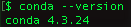
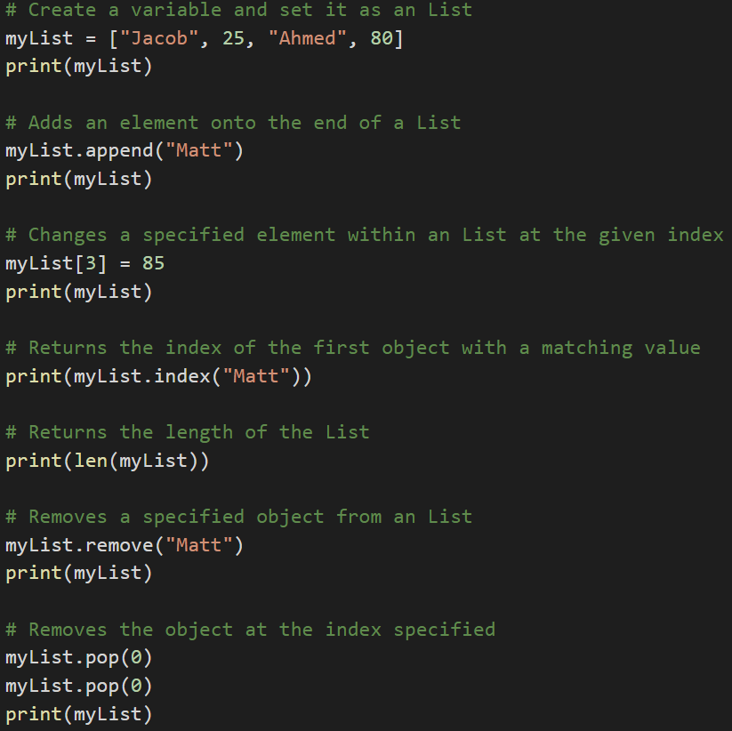
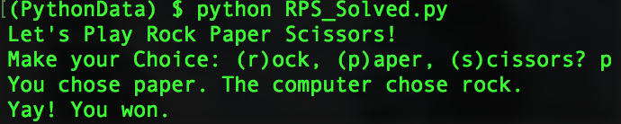

## 3.1 Lesson Plan - Let's Begin Python

### Overview

In today's class, students will transition from VBA to the programming language Python. Today's class will check Python installation for students, then cover the basics of terminal navigation, variables, conditionals, and loops.

### Class Objectives

* Students will check Python 3 installation.
* Students will be able to navigate their desktop via the terminal.
* Students will be able to create Python scripts and run them in the terminal.
* Students will be able to understand basic programming concepts in Python.

### Instructor Notes

* Students should all have a working `conda` environment during this class, but take the time to make sure that everyone can use `conda` before moving on. Also, everyone should use a `conda` environment for all of the activities today. Students may need a reminder to activate this environment. Windows users will also need to launch their environment with `git-bash` and not their Windows command prompt or PowerShell.

* There is a lot to cover over the course of today's class and students may find themselves frustrated by any number of the quirks Git Bash, Anaconda, Terminal, and Python have in store for them. Despite all of this, however, maintain a positive tone and be prepared to help the class fix whatever bugs they stumble upon.

* Be on the lookout for confused students who are reluctant to raise their hands and ask for assistance. Have the TAs walk around during the first sections which deal with console commands especially as very few students will have ever worked with the computer in this way. Also, make sure to encourage the class to raise their hands whenever they are confused and reassure them that confusion is simply a part of the learning process.

* Have your TAs refer to the [Time Tracker](TimeTracker.xlsx) to stay on track.

### Sample Class Video (Highly Recommended)

* To view an example class lecture visit (Note video may not reflect latest lesson plan): [Class Video](https://codingbootcamp.hosted.panopto.com/Panopto/Pages/Viewer.aspx?id=cb19ac19-abfe-4360-b9a4-dfac2b25d551)

- - -

### 1. Instructor Do: Intro to Python (0:03)

* Welcome students to class and explain that the class is now going to move on to a more traditional programming language, Python. This will be the primary language for the next several weeks.

* Explain to students that the most significant change from Visual Basic will be syntax and that the fundamental concepts are the same.

* Slack out the following files to be used as reference guides as students progress through Python.

  * [Student Guide](../StudentGuide.md)

  * [Python CheatSheet](../Supplemental/Python_Reference_Guide.pdf)

### 2. Instructor Do: Terminal (0:10)

* Explain that all of the Python code will be executed through either git-bash or the Mac terminal. Windows users should always use `git-bash` while Mac users should use the terminal.

* Open up the terminal or git-bash and walk through the following commands:

  * `cd` (Changes the directory).

  * `cd ~` (Changes to the home directory).

  * `cd ..` (Moves up one directory).

  * `ls` (Lists files in the folder).

  * `pwd` (Shows the current directory).

  * `mkdir <FOLDERNAME>` (Creates a new directory with the FOLDERNAME).

  * `touch <FILENAME>` (Creates a new file with the FILENAME).

  * `rm <FILENAME>` (Deletes a file).

  * `rm -r <FOLDERNAME>` (Deletes a folder, make sure to note the -r).

  * `open .` (Opens the current folder on Macs).

  * `explorer .` (Opens the current folder on Bash).

  * `open <FILENAME>` (Opens a specific file on Macs).

  * `explorer <FILENAME>` (Opens a specific file on Bash).

  .

* Slack out [CommonCommands.txt](Activities/01-Ins_Terminal/Solved/CommonCommands.txt) for students to use as a reference. Answer any questions up until this point.

* This is basic terminal navigation, from here show how students can edit Python files and run in terminal.

  * Create and navigate into the `PythonStuff` folder on the desktop.

  * Create and open `first_file.py` in the text editor.

  * Add `print("This is my first Python file")` and save the code.

  * Return to the terminal and run the file using `python first_file.py`.

  * Explain that `python <FILENAME>.py` tells the computer that this is a python file and to run the code contained within.

  * Repeat again with `second_file.py` using the code `print("This is my second python file")`.

  

### 3. Students Do: Terminal (0:10)

* Students will now dive into the terminal, create three folders, and a pair of Python files which will print some strings of their own creation to the console.

* After answering whatever questions your students may have regarding the activity, slack out the instructions.

* **Instructions**

* Follow along with these instructions in your terminal and write the commands below:

  * Create a folder called `LearnPython`.

  * Navigate into the folder.

  * Inside `LearnPython` create another folder called `Assignment1`.

  * Inside `Assignment1` create a file called `quick_python.py`.

  * Add a print statement to `quick_python.py`.

  * Run `quick_python.py`.

  * Return to the `LearnPython` folder.

  * Inside `LearnPython` create another folder called `Assignment2`.

  * Inside `Assignment2` create a file called `quick_python2.py`.

  * Add a different print statement to `quick_python2.py`.

  * Run `quick_python2.py`.

### 4. Instructor Do: Review Terminal (0:05)

* Open [TerminalGamesSolved.sh](Activities/02-Stu_TerminalTest/Solved/TerminalGamesSolved.sh) and work through the code in the solution in the terminal while also showing the results on the computer.

* Key points to cover during the review of this activity:

  * `mkdir` will make the directories.

  * `cd` is changing into them.

  * `touch` will create the file.

  * To add lines of code to these files simply edit them within a text editor.

  * Afterwards, using `python quick_python.py` will run the code.

  * `cd ..` will bring the terminal back a to the `LearnPython` folder where the process can be repeated.

### 5. Everyone Do: Check Anaconda installation (0:05)

* Complete a quick check to ensure students have conda installed `conda` and added to their path.

* Open up the console and have students follow along.

  * Enter `conda --version` which will display the version of Anaconda install.

    

* Have TAs help any students with issues. The most common problem will be students with Windows that don't have the Anaconda PATH variable set.

  * This can be fixed by manually adding the PATH to Windows' environment variables, but can be more easily solved by uninstalling/reinstalling Anaconda and making sure to check the "Install to Path" box that comes up in a menu.

### 6. Everyone Do: Create A Virtual Environment (0:10)

* Next move on to explaining [virtual environments](https://conda.io/docs/user-guide/tasks/manage-environments.html).

  * Virtual environments create an isolated environment for Python projects.

  * Explain how different projects can have different dependencies.

  * Explain how different projects might also use different types and versions of libraries.

  * This virtual environment will make sure the class has all the right dependencies for future class activities.

* Create a virtual environment that will run Python 3.6. This will help solve issues where students have multiple versions of Python installed.

  * First run `conda create -n PythonData python=3.6 anaconda` in the terminal. Warn students that this may take a few minutes to install.

  * Now enter `source activate PythonData` to activate the environment. When `(PythonData)$` appears, this means you are in the environment.

  * Now make sure everyone is using the correct version of Python by entering `python --version`.

    

  * Lastly, show that you can exit the environment by entering `source deactivate`.

* Remind students that they will need to activate their environment each time that they open a new terminal. Windows users should always use `git-bash` for their terminal.

### 7. Instructor Do: Variables (0:05)

* Open up the file [variables.py](Activities/03-Ins_Variables/Solved/variables.py) and explain to students that variables let us store information that we can later use.

  * Remind students how VBA accessed certain values when they referred to a specific cell. This is essentially what a variable is doing in Python, a value is being stored there.

* Show the students the code and explain the following...

  * Variables can store different data types like strings, integers and an entirely new data type called booleans which hold `True` or `False` values.

    ```python
    # Creates a variable with a string "Frankfurter"
    title = "Frankfurter"

    # Creates a variable with an integer 80
    years = 80

    # Creates a variable with the boolean value of True
    expert_status = True
    ```

  * We can print statements which include variables, but traditional Python formatting won't concatenate strings with other data types. This means integers and booleans must be cast as strings using the `str()` function.

    ```python
    # Prints a statement adding the variable
    print("Nick is a professional " + title)

    # Convert the integer years into a string and prints
    print("He has been coding for " + str(years) + " years")

    # Converts a boolean into a string and prints
    print("Expert status: " + str(expert_status))
    ```

  * However, the `f-string` method of formatting strings allows string concatenation with different data types. Demonstrate the differences by refactoring the last print statement as an `f-string`:

    ```python
    # An f-string accepts all data types without conversion
    print(f"Expert status: {expert_status}")
    ```

* Slack out the following reference guide for [Python 3's f-Strings](https://realpython.com/python-f-strings/).

* Answer any questions students may have before moving onto the next activity.

### 8. Students Do: Hello Variable World! (0:10)

* It is now time to create a simple Python application that uses variables. It will both run calculations on integers and print strings out to the console.

* Open up [04-Stu_HelloVariableWorld](Activities/04-Stu_HelloVariableWorld/Solved/HelloVariableWorld.py) within the terminal and run the code to show students how the application should function.

  

* **Instructions**

  * Create two variables called `name` and `country` that will hold strings.

  * Create two variables called `age` and `hourly_wage` that will hold integers.

  * Create a variable called `satisfied` which will hold a boolean.

  * Create a variable called `daily_wage` that will hold the value of `hourly_wage` multiplied by 8.

  * Print out statements using all of the above variables to the console.

### 9. Everyone Do: Review Hello Variable World (0:05)

* Open up the code contained within [04-Stu_HelloVariableWorld](Activities/04-Stu_HelloVariableWorld/Solved/HelloVariableWorld.py) and go over the solution file line by line with the class, answering whatever questions students may have.

* Key points to cover over the course of the discussion:

  * Each of the variables has to be declared individually but do not have to be cast at declaration. Python figures out data type on its own.

  * Integer variables can easily be placed into calculations simply by using their name.

  * Even though booleans look like strings, they do no use quotations in their declaration.

    

  * When traditionally printing out integers and booleans with strings, the variables must be cast as strings as well. Without casting them as strings, the console will return an error.

  ```python
  # Print out the user's age
  print("You are " + str(age) + " years old")
  ```

  * When using an f-string, integers and booleans do not need to be cast as strings. Also, the syntax is slightly different: variables are enclosed in curly braces, there are no plus signs, and a single set of quotation marks around the entire string.

  ```python
  # With an f-string, print out the daily wage that was calculated
  print(f"You make {daily_wage} per day")

  # With an f-string, print out whether the users were satisfied
  print(f"Are you satisfied with your current wage? {satisfied}")
  ```

### 10. Instructor Do: Inputs and Prompts (0:05)

* Open [inputs.py](Activities/05-Ins_Prompts/Solved/inputs.py) and then run the code within the terminal before opening the code up in the text editor.

  

* Next explain how the code does the following...

  * Takes input from the command line after printing a prompt to the terminal.

  * The variable `name` will store the user's response to the prompt.

  * Every response to an input is stored as a string regardless of the characters entered. As such, variables that are intended to be integers must be cast to be used in calculations.

  * The `bool()` function always returns `True` if any text is inside of it.

  * Print statements can be concatenated with variables so long as they are also strings or are cast as strings.

    ```python
    # Collects the user's input for the prompt "What is your name?"
    name = input("What is your name? ")

    # Collects the user's input for the prompt "How old are you?"
    # and converts the string to an integer.
    age = int(input("How old are you? "))

    # Collects the user's input for the prompt "Is input truthy?"
    # and converts it to a boolean.
    # Note that non-zero, non-empty objects are truth-y.
    trueOrFalse = bool(input("Is the input truthy? "))

    # Creates three print statements that to respond with the output.
    print("My name is " + str(name))
    print("I will be " + str(age + 1) + " next year.")
    print("The input was converted to " + str(trueOrFalse))
    ```

### 11. Student Do: Down To Input (0:07)

* This exercise will give the students a chance to work on storing inputs from the command line and run some code based upon the values entered.

* Open up [06-Stu_DownToInput](Activities/06-Stu_DownToInput/Solved/DownToInput.py) within the terminal and run the code to show students how the application should function.

  

* **Instructions:**

  * Create two different variables that will take the input of your first name and your neighbor's first name.

  * Create two more inputs that will ask how many months each of you has been coding.

  * Finally, display a result with both your names and the total amount of months coding.

### 12. Instructor Do: Review Down To Input (0:05)

* Open up the code contained within [06-Stu_DownToInput](Activities/06-Stu_DownToInput/Solved/DownToInput.py) and go over the solution file line by line with the class, answering whatever questions students may have.

* Key points to cover in discussing this code:

  * The variables `your_first_name` and `neighbor_first_name` are set using two inputs and, since they are strings, will not have to be cast later on.

  * The `months_you_coded` and `months_neighbor_coded` are set using two more inputs but have to be added together. As such, they will need to be cast as integers later on.

  * After calculating the total number of months, this new integer variable will have to be cast as a string to be printed.

    

### 13. Instructor Do: Conditionals (0:10)

* Open [conditionals.py](Activities/07-Ins_Conditionals/Solved/conditionals.py) in a text editor and run through the code with the class.

* Students should be familiar with conditionals after their time with VBA, so explain to them that the logic in Python is nearly the same. The primary difference is the syntax and indentation.

  * Python uses `if`, `elif`, and `else` for creating conditionals.

  * Conditional statements are concluded with a colon but all lines after the colon **must** be indented to be considered a part of that code block. This is because Python reads blocks of code based on indentation.

    

  * All sorts of operators like greater than, less than, equal to, and much more can be used to create logic tests for conditionals.

  * The condition `is equal to` uses `==` while variable assignment uses one equal sign.

  * Multiple logic tests can be checked within a single conditional statement. Using the term `and` must mean both tests return `True` while `or` require that only one test return as true.

  * Conditionals can even be nested, allowing programmers to run logic tests based upon whether or not the original logic test returned as `True`.

    

* Answer whatever questions the class may have before slacking out the code for students to reference during the next exercise.

### 14. Students Do: Conditional Conundrum (0:10)

* During this activity, students will be looking through some pre-written conditionals and attempting to figure out what lines will be printed to the console.

* **File:**

  * [conditionals_unsolved.py](Activities/08-Stu_ConditionalConundrum/Unsolved/conditionals_unsolved.py)

* **Instructions:**

  * Look through the conditionals within the provided code and figure out which lines will be printed to the console.

  * Do not run the application at first, see if you can follow the thought process for each chunk of code and then place a guess. Only after coming up with a guess for each section should you run the application.

* **Bonus:**

  * After figuring out the output for all of the code chunks, create your own series of conditionals to test your fellow students. Once you have completed your puzzle, slack it out to everyone so they can test it.

### 15. Instructor Do: Review Conditionals Conundrum (0:05)

* Open up the code contained within [08-Stu_conditionalConundrum](Activities/08-Stu_ConditionalConundrum/Solved/conditionals_solved.py) and go over the solution file line by line with the class, answering whatever questions students may have.

* Key points to cover during this discussion:

  * The `if` statement for the first code chunk checks whether `10 > 10`, which is false. As such the code will return "ooo needs some work".

    

  * The length of "Dog" is 3 and `x` is 5, thus making the statement for the second chunk of code true and returning "Question 2 works!"

    

  * The addition of the `and` statement to the third chunk of code means both logic tests need return `True` to run. Thankfully both do and thus "GOT QUESTION 3!" is printed.

    

  * Conditionals work by going form the top down. The logic tests in chunk four do not return as `True` until the third conditional and, as such, "Dan is in group three" is printed.

    

  * Within chunk five, one of the conditions are met in the third conditional, but it's not until getting into the `or` statement of the fourth conditional that the logic test finally returns as `True`.

    

* Slack out the solution above and then ask the class if anyone would like to share their creations from the bonus section of the activity.

  * Have students slack out their code and then explain how their conditional puzzles worked with the class.

- - -

### 16. Break (0:15)

- - -

### 17. Instructor Do: Lists (0:10)

* Welcome students back from break and let them know that the next data type they will be uncovering are lists.

  * Lists are the Python equivalent of arrays in VBA, functioning in much the same way by holding multiple pieces of data within one variable.

  * Lists can hold multiple types of data inside of them as well. This means that strings, integers, and boolean values can be stored within a single list.

* Open [lists.py](Activities/09-Ins_List/Solved/lists.py) and explain how a list called `myList` was created that contains a mix of data types.

  * The `append` method can add elements on to the end of a list.

  * The `index` method returns the numeric location of a given value within a list.

  * The `len` function returns the length of a list.

  * The `remove` method deletes a given value from a list.

  * The `pop` method can be used to remove a value by index.

  * Remind students that indexing in lists starts at `0`.

  

* Python also has a data type called tuples that are functionally similar to lists in what they can store but are immutable.

  * While lists in Python can be modified after their creation, tuples can never be modified after their declaration.

  * Tuples tend to be more efficient to navigate through than lists and also protect the data stored within from being changed.

  * For more info on tuples, have your students check this [quora question](https://www.quora.com/What-advantages-do-tuples-have-over-lists) out.

  

* Answer any questions students may have about lists before moving onto the next activity.

### 18. Students Do: Rock, Paper, Scissors (0:15)

* During this time, students will be creating a simple game of Rock, Paper, Scissors that will run within the console.

* Open [RPS_Solved.py](Activities/10-Stu_RockPaperScissors/Solved/RPS_Solved.py) within the terminal and run the application to show students what the game will look like.

  

* Open [RPS_Unsolved.py](Activities/10-Stu_RockPaperScissors/Unsolved/RPS_Unsolved.py) within a text editor and tell students that this will be their starter code.

* Explain how the code imports a module called `random` that will allow the computer make a choice randomly from a list of actions.

* Mention to the class how they will be diving far more deeply into modules during the next class.

* Direct them towards the [documentation](https://docs.python.org/2/library/random.html) for the `random` module and explain how, by importing the random library, they will now have access to all these functions within their code.

* **Files**

  * [RPS_Unsolved.py](Activities/10-Stu_RockPaperScissors/Unsolved/RPS_Unsolved.py)

* **Instructions:**

  * Using the terminal, take an input of `r`, `p` or `s` which will stand for rock, paper, and scissors.

  * Have the computer randomly pick one of these three choices.

  * Compare the user's input to the computer's choice to determine if the user won, lost, or tied.

* **Hints:**

  * Look into this [stackoverflow](https://stackoverflow.com/questions/306400/how-to-randomly-select-an-item-from-a-list) question for help on using the `random` module to select a value from a list.

### 19. Instructor Do: Review Rock, Paper, Scissors (0:05)

* Open up the code contained within [RPS_Solved.py](Activities/10-Stu_RockPaperScissors/Solved/RPS_Solved.py) and go over the solution file line by line with the class, answering whatever questions students may have.

* Key points to cover when discussing this activity:

  * In the starter code, `random.choice` will pick a random choice within the `options` list for the computer and store its pick within a variable called `computer_choice`.

  * The application prompts the user for their option and stores it within a variable called `user_choice`.

  * Knowing that rock beats scissors, scissors beats paper, and paper beats rock the code can be organized into a series of conditional statements to compare the user's choice to the computer's choice.

  

### 20. Instructor Do: Loops (0:10)

* The next topic, loops, was also covered during VBA but students may still struggle with grasping the syntax in Python, so make sure to field questions as you proceed through the activity.

* Open up [11-Ins_Loops](Activities/11-Ins_Loops/Solved/LoopDeeLoop.py) within a text editor and explain the following...

  * The variable `x` is created within the loop statement and could theoretically take on any name so long as it is unique.

  * When looping through a range of numbers, Python will halt the loop one number before the final number. For example, when looping from 0 to 5, the code will run five times, but `x` will only ever be printed as 0 through 4.

  * When provided with a single number, `range()` will always start the loop at 0. When provided with two numbers, however, the code will loop from the first number until it reaches one less than the second number.

    

  * Python can also loop through all of the letters within a string or all of the values stored within a list by using the syntax `for <variable> in <string or list>:`.

    

  * `while` loops will run blocks of code just like a `for` loop does but will continue looping for as long as a condition is met.

    

### 21. Students Do: Number Chain (0:14)

* Next up is a number chain exercise that will take user input and print out a string of numbers. Feel free to add extra time to this exercise as it will be the last of the day and is critical to students understanding how loops work.

* Open [NumberChain_Solved.py](Activities/12-Stu_NumberChain/Solved/NumberChain_Solved.py) and run the code to show the result.

  

* **Instructions:**

  * Using a `while` loop, ask the user "How many numbers?", and then print out a chain of ascending numbers from 0 to the number input.

  * After the results have printed, ask the user if they would like to continue. If "y" is entered, keep the chain running by inputting a new number and starting a new count from 0 to the number input. If "n" is entered, exit the application.

* **Bonus:**

  * Rather than just displaying numbers starting at 0, have the numbers begin at the end of the previous chain.

### 22. Instructor Do: Review Number Chain (0:04)

* Open up the code contained within [NumberChain_Solved.py](Activities/12-Stu_NumberChain/Solved/NumberChain_Solved.py) and go over the solution file line by line with the class, answering whatever questions students may have.

* For the regular solution explain:

  * The initial value for `user_play` is set to "y" so that the `while` loop will run initially. This loop will continue to run so long as the value of `user_play` is "y" at the end of the code block.

  * An input number is asked for and then a `for` loop will then run to count from 0 to that number.

  * The user is then prompted to either enter "y" if they would like to create a new number chain or "n" if they would like to terminate the application.

    ```python
    # Initial variable to track game play
    user_play = "y"

    # While we are still playing...
    while user_play == "y":

        # Ask the user how many numbers to loop through
        user_number = input("How many numbers? ")

        # Loop through the numbers. (Be sure to cast the string into an integer.)
        for x in range(int(user_number)):

            # Print each number in the range
            print(x)

        # Once complete...
        user_play = input("Continue: (y)es or (n)o? ")
    ```

  * For the bonus solution, just add in a variable called `start_number` whose initial value is 1 and whose value will be set to the last number used in the loop after the `for` loop has completed.

  * The `for` loop will now run from the range of `start_number` to `user_number` plus `start_number`. This means that the code will always count up the inputted amount from the previous input amount.

### 23. Instructor Do: Homework Solution and Close Class (0:02)

* Slack out the video link for the Unit 1 Homework: [KickStart My Chart](https://youtu.be/6n-yAz3w5w0). Encourage students to review it later and utilize office hours if they have any questions.

### 24. Instructor Do: Preview Homework (0:00)

* With any remaining time give a preview of the homework. Explain that they will be reading from a csv and formulating the results using Python. Explain that they will be given two data sets where their scripts will need to work for each. Encourage them that they may not have all the tools to complete this after today's class, but they will by the end of the week.

* Wish them well and that you will see them, next class.

- - -

### LessonPlan & Slideshow Instructor Feedback

* Please click the link which best represents your overall feeling regarding today's class. It will link you to a form which allows you to submit additional (optional) feedback.

* [:heart_eyes: Great](https://www.surveygizmo.com/s3/4381674/DataViz-Instructor-Feedback?section=python-day-1&lp_useful=great)

* [:grinning: Like](https://www.surveygizmo.com/s3/4381674/DataViz-Instructor-Feedback?section=python-day-1&lp_useful=like)

* [:neutral_face: Neutral](https://www.surveygizmo.com/s3/4381674/DataViz-Instructor-Feedback?section=python-day-1&lp_useful=neutral)

* [:confounded: Dislike](https://www.surveygizmo.com/s3/4381674/DataViz-Instructor-Feedback?section=python-day-1&lp_useful=dislike)

* [:triumph: Not Great](https://www.surveygizmo.com/s3/4381674/DataViz-Instructor-Feedback?section=python-day-1&lp_useful=not%great)

- - -

### Copyright

Trilogy Education Services © 2018. All Rights Reserved.
