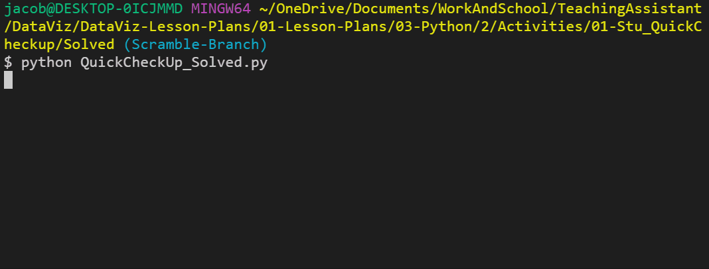
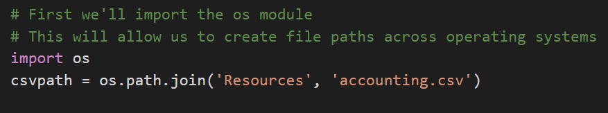
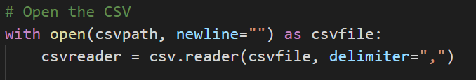
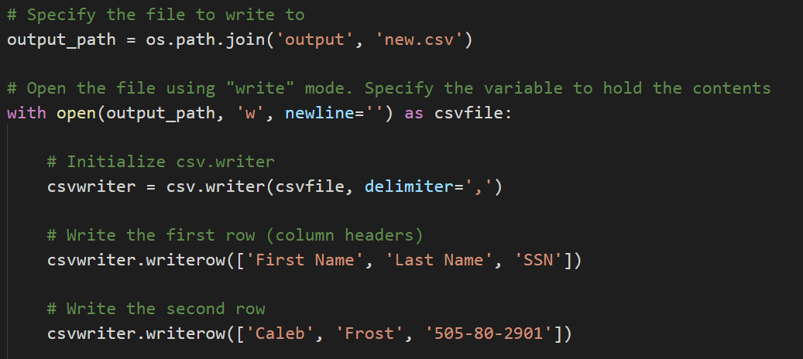
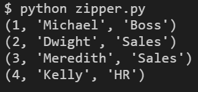

## 3.2 Lesson Plan - Reading, Writing, and Pyrithmetic

### Overview

During today's class, the class will be diving further into reading and writing data from/to external CSV files. They will also dive into Python dictionaries, zipping lists, and functions.

### Class Objectives

* Students should feel confident reading data into Python from CSV files

* Students should feel confident writing data from Python into CSV files

* Students should know how to zip two lists together and when this is helpful

* Students should have a firm understanding on how to create and use Python functions

### Instructor Notes

* Today is a challenging but immensely useful class that pertains directly to the homework. Nevertheless, today should be a fun class due to the number of engaging activities students will have access to. There will be some frustrations and hurdles to overcome, but so long as the class trudges through the challenges they will come out all the stronger.

* The first half of today's class is far more relevant to this week's homework than the latter half. As such, feel free to provide students with additional time so they are able to sufficiently complete the activities.

* Have your TAs refer to the [Time Tracker](TimeTracker.xlsx) to stay on track

- - -

### 1. Instructor Do: Welcome Class (0:05)

* Welcome students to today's class and reassure them that, even though this stuff is tough, practice makes perfect. The more they work with Python, the more sense it will make.

### 2. Students Do: Python Check-Up (0:10)

* Since last class introduced quite a lot of new material, today's lesson will start with a quick warmup activity to get the Python juices flowing!

* Run [01-Stu_QuickCheckup/quick_check_up.py](Activities/01-Stu_QuickCheckup/Solved/quick_check_up.py) within the terminal so that students can see what they are making before slacking out the starter file and instructions.



* **File:**

  * [01-Stu_QuickCheckup/quick_check_up.py](Activities/01-Stu_QuickCheckup/Unsolved/quick_check_up.py)

* **Instructions:**

  * Create a simple Python command line application. Upon running, the application should:

    * Print "Hello User!"

    * Then ask: "What is your name? "

    * Then respond: "Hello &lt;user's name>"

    * Then ask: "What is your age? "

    * Then respond: "Awww... you're just a baby!" or "Ah... A well traveled soul are ye." depending on the user's age.

* **Hints:**

  * Remember to cast your variables!

### 3. Everyone Do: Python Check-Up Review (0:05)

* Slack out [01-Stu_QuickCheckup/quick_check_up.py](Activities/01-Stu_QuickCheckup/Solved/quick_check_up.py) and go over the code with the class, answering any questions students may have regarding the activity.

* Key points to cover during the discussion of this code:

  * The `name` variable is being set to whatever the user inputs as their response to the question "What is your name?"

  * Since the `age` variable is taken in as a string when inputted, it has to be cast as an integer when run through the conditionals.

  

### 4. Instructor Do: Loop Recap (0:05)

* Open up [02-Ins_SimpleLoops/simple_loops.py](Activities/02-Ins_SimpleLoops/Solved/simple_loops.py) within the editor to refresh the class on how to create basic loops.

* You may want to have the students inspect the code and discuss it with the people around them before running each for loop separately.

  * A For loop will loop through a range of numbers, the letters in a string, or the elements within a list one at a time.

  

  * A While loop will loop through the code contained inside of it until some condition is met.

  

* Answer whatever questions the class may have regarding loops before moving onto the next activity.

### 5. Students Do: Kid in a Candy Store (0:15)

* Each student is being placed in the role of a kid going with their parents to the supermarket. After pestering their parents for a while, they finally are allowed to pick out some candy to take home.


* Open up the [03-Stu_KidInCandyStore/kid_in_candy_store.py](Activities/03-Stu_KidInCandyStore/Solved/kid_in_candy_store.py) within the terminal and run through the application to show students how it functions.

* **Files:**

  * [KidInCandyStore_Unsolved.py](Activities/03-Stu_KidInCandyStore/Unsolved/kid_in_candy_store.py)

* **Instructions:**

  * Create a loop that prints all of the candies in the store to the terminal with their index stored in brackets beside them.

    * For example: `"[0] Snickers"`

  * Create a loop that runs for a number of times as determined by the variable `allowance`.

    * For example: If allowance is equal to five, the loop should run five times.

  * Each time this second loop runs, take in a user's input - preferably a number - and then add the candy with a matching index to the variable `candyCart`.

    * For example: If the user enters "0" as their input, "Snickers" should be added into the `candyCart` list.

  * Use another loop to print all of the candies selected to the terminal.

* **Bonus:**

  * Create a version of the same code which allows a user to select as much candy as they want up until they say they do not want any more.

### 6. Everyone Do: Kid in a Candy Store Review (0:05)

* Slack out the [03-Stu_KidInCandyStore/kid_in_candy_store.py](Activities/03-Stu_KidInCandyStore/Solved/kid_in_candy_store.py) of the previous activity and go over the code with the class, answering whatever questions they may have.

* Key points to cover in the discussion of this code:

  * There are three For loops being used in this activity. One to print out the original candy list. A second to collect all of the candy choices the user has. And a third to print the final list of choices to the screen.

  * When adding candies into the `candyCart` list, the `selection` variable has to be cast as an integer since all inputs are naturally set as strings.

  * In order to solve the bonus, we would simply use a While loop instead of a For loop, asking after each selection whether the user would like to make another selection. If they ever answer anything other than "Yes", the loop will stop.

  

### 7. Students Do: House of Pies (0:20)

* From one form of sweets to another. In this activity, the class will be constructing an order form that will display a list of pies and then prompt users to make a selection. It will continue to prompt for selections until the user decides to terminate the process.

* This activity comes in three parts: an easy version that is very much like the previous activity and a hard version which is very challenging. Encourage students to try their luck on the hardest version if they are feeling confident.


* Open up the [04-Stu_HouseOfPies/Solved/house_of_pies_bonus.py](Activities/04-Stu_HouseOfPies/Solved/house_of_pies_bonus.py) within the terminal and run through the application to show students how it functions.

* **Instructions:**

  * **Part 1**

    * Create an order form that will display a list of pies to the user in the following way:

    ```
    Welcome to the House of Pies! Here are our pies:

    ---------------------------------------------------------------------
    (1) Pecan, (2) Apple Crisp, (3) Bean, (4) Banoffee,  (5) Black Bun, (6) Blueberry, (7) Buko, (8) Burek,  (9) Tamale, (10) Steak
    ```

    * Then prompt the user to select which pie they'd like to order via number.

    * Immediately after, follow the order with `Great! We'll have that <PIE NAME> right out for you` and then ask if they would like to make another order. If so, repeat the process.

    * Once the user is done purchasing pies, print the total number of pies ordered.

  * **Part 2 (Very Challenging!)**

    * Modify the application once again, this time conclude the user's purchases by listing out the total pie count broken by _each_ pie.

    ```
    You purchased:
    0 Pecan
    0 Apple Crisp
    0 Bean
    2 Banoffee
    0 Black Bun
    0 Blueberry
    0 Buko
    0 Burek
    0 Tamale
    1 Steak
    ```

### 8. Everyone Do: House of Pies Review (0:10)

* Slack out the [04-Stu_HouseOfPies/house_of_pies_bonus.py](Activities/04-Stu_HouseOfPies/Solved/house_of_pies_bonus.py) of the previous activity and go over the code with the class, answering whatever questions they may have.

* Important points to touch upon during this discussion:

  * Since the GUI for the application starts with 1, the user's input must be subtracted by 1 one when referencing the pie's actual index. This is because all indices start at 0 naturally.

  * The primary loop being used is a While loop that is constantly checking whether the user's response to the question `Would you like to make another purchase?` ever changes from `y`

  * The means by which the total number of pies is calculated in the original solution is by determining the length of the `pie_purchases` array.

  * Within the bonus, the means by which the code is keeping track of how many pie purchases are being made for each type of pie is by having a second list that corresponds to the first filled with 0 values. Every time a pie is chosen, therefore, the code adds one to the index of the `pie_purchases` list that is equal to that of the original `pie_list`.

    ```python
    # While we are still shopping...
    while shopping == "y":

        # Show pie selection prompt
        print("---------------------------------------------------------------------")
        print("(1) Pecan, (2) Apple Crisp, (3) Bean, (4) Banoffee, " +
              " (5) Black Bun, (6) Blueberry, (7) Buko, (8) Burek, " +
              " (9) Tamale, (10) Steak ")

        pie_choice = input("Which would you like? ")

        # Get index of the pie from the selected number
        choice_index = int(pie_choice) - 1

        # Add pie to the pie list by finding the matching index and adding one to its value
        pie_purchases[choice_index] += 1

        print("------------------------------------------------------------------------")

        # Inform the customer of the pie purchase
        print("Great! We'll have that " + pie_list[choice_index] + " right out for you.")

        # Provide exit option
        shopping = input("Would you like to make another purchase: (y)es or (n)o? ")

    # Once the pie list is complete
    print("------------------------------------------------------------------------")

    # Count instances of each pie
    print("You purchased: ")

    # Loop through the full pie list
    for pie_index in range(len(pie_list)):
        pie_count = str(pie_purchases[pie_index])
        pie_name = str(pie_list[pie_index])

        # Gather the count of each pie in the pie list and print them alongside the pies
        print(pie_count + " " + pie_name)
    ```

### 9. Instructor Do: Reading Text Files (0:05)

* Another function of Python is that it is capable of reading data in from external text files and then performing some tasks on it.

* Open up [05-Ins_BasicRead/read_file.py](Activities/05-Ins_BasicRead/Solved/read_file.py) and [05-Ins_BasicRead/Resources/input.txt](Activities/05-Ins_BasicRead/Resources/input.txt), going over the syntax and purpose of the code contained within.

  * When dealing with external files, Python requires very precise directions on what path to follow to reach the desired file. As such, if the desired file is stored within a sub-folder called "Resources", the path needed would be "Resources/FileName.txt".

  * It is critical to note that different operating systems use different paths to locate files. For example: Windows machines will often use forward slashes to separate folders while Mac devices will use backslashes.

  

  * The `with` statement is simply saying that, for as long as we are dealing with the code within the following block, save the text variable. Once the code block has completed, the text variable will be "cleaned up" and removed to save memory.

  * `open(<File Path>, <Read/Write>)` is the function Python uses in order to open up and work with external text files. By specifying wither `'r'`, `'w'`, or `'rw'`, users can use the `open()` function to either read from a text file, write to a text file, or perform both operations within the following code block.

  * `text.read()` parses the data that is read in by the `open()` function and converts it into a string type. If this function was not used all that would be printed to the screen would be an unhelpful text wrapper object.

  

### 10. Instructor Do: Introduction to Modules (0:05)

* While Python includes many built-in functions, sometimes coders have to bring in external modules in order to perform specific tasks.

  * If a coder wanted a random number generator for a dice game they were making, for example, they would most likely want to use the `random` module instead of having to create the code from scratch.

* Importing modules into Python is actually very simple. All that is required is for the module to be installed and for the user to import the module into their code.

  * All of the modules for today come packaged with Python, so there is no need to install anything new.

* Open up [06-Ins_Modules/imports.py](Activities/06-Ins_Modules/Solved/imports.py) within your editor and show the class how to import modules into their code.

  * The `string` module contains many helpful constants and methods which pertain to strings. For example, users can use `string.ascii_letters` and Python will instantly grab a reference to every ascii character.

  
  

  * The `random` module does exactly what one might expect, it allows Python to randomly select values from set ranges, lists, or even strings.

  
  

### 11. Students Do: Module Playground (0:05)

* There are tons of built-in modules for Python and there is no possible way that a single class could cover all of them. For the time being, however, provide students with the opportunity to look through some of Python's modules and play around with them.

* The class will come back together after a couple of minutes to discuss some of the modules that were uncovered before moving on.

* **Links:**

  * [List of Built-In Python Modules](https://docs.python.org/3/library/index.html)

### 12. Everyone Do: Module Playground Review (0:05)

* Call the class back together and ask if there were any modules in particular that folks found useful. Have those students that answer stand and discuss the module that they found and how it could be used.

* If no one offers up any modules that they found, feel free to call upon some random students to encourage engagement.

- - -

### 13. BREAK (0:15)

- - -

### 14. Instructor Do: Reading In CSV Files (0:10)

* While reading in text files can be useful in some circumstances, it is more likely within the data industry to run across files known as CSV files.

  * CSV stands for **Comma** **Separated** **Values** and is essentially a table that has been converted into text format with each row and column being separated by specified symbols.

  * More often than not each row is located on a new line and each column is separated by a comma. Seems simple enough since this is why the file type is called Comma Separated Values.

    

* Python has a module called `csv` which allows its users to easily pull in data from external CSV files and perform some operations upon them.

* Open up [07-ReadCSV](Activities/07-Ins_ReadCSV/Solved/read_csv.py) within the editor and go over the code contained within with the class.

  * The first major piece of code to point out is the importing and usages of the `os` module. This module allows Python programmers to very easily create dynamic paths to external files that function across different operating systems.

  

  * The second major point to make is that the code is still using the `with open()` syntax from earlier to read in the file originally. The key difference here is that this code now includes the `newline=''` parameter. This tells Python that each time the CSV file goes down a line, it should be considered a new row.

  * Instead of `text.read()`, this new code instead utilizes `csv.reader()` to translate the object being opened by Python. It is critical to note the `delimiter=','` parameter being used as this tells Python that each comma within the CSV should be seen as moving into a new column for a row.

  * Reiterate to students that the reading of the file must be done within `with open()` statement.  Outside of that block of code, the variable `csvreader` will not be available.  In a later example, students will see that one option for working with the data outside of `with open()` is to append it to a list.

    

  * The code then loops through each row of the CSV and prints out the contents. Make sure to point out how each value is being shown as a string and how all of the rows are lists.

    

### 15. Students Do: Reading Netflix (0:15)

* In this activity, students will be provided with a CSV file containing data taken from Netflix. They will then create an application which searches through the data for a specific movie/show and returns the name, rating, and review score for it.

  

* After opening up the [08-Stu_ReadNetFlix/netflix.py](Activities/08-Stu_ReadNetFlix/Solved/netflix.py) of this activity in order to show students how their application should function, slack out the following file and instructions.

* **File:**

  * [Netflix_Ratings.csv](Activities/08-Stu_ReadNetFlix/Resources/netflix_ratings.csv)

* **Instructions:**

  * Prompt the user for what video they are looking for.

  * Search through the `netflix_ratings.csv` to find the user's video.

  * If the CSV contains the user's video then print out the title, what it is rated and the current user ratings.

    * For example: `'Grease is rated PG with a rating of 86'`

* **Bonus:**

  * Insert a `break` statement into the for loop to stop the loop when the first movie is found to stop duplicated results. See the [documentation](https://docs.python.org/3.6/reference/simple_stmts.html#break) for additional info.

  * If the CSV does not contain the user's video then print out a message telling them that their video could not be found.

### 16. Everyone Do: Review Reading Netflix (0:05)

* Slack out the [08-Stu_ReadNetFlix/netflix.py](Activities/08-Stu_ReadNetFlix/Solved/netflix.py) of the previous activity and go over the code with the class, answering whatever questions they may have.

* Important topics to cover when discussing this activity:

  * Before doing anything else, Python imports both the `os` and `csv` modules for use later on. It is common practice to import all modules at the start of an application.

  * When opening up the CSV file, the code dictates that each new line in the file should be viewed as a new line of data to be read in.

  

  * When reading the CSV file, the delimiter is set to `","` to ensure Python splits up the data into the proper columns whenever a comma is found.

  * The code loops through each row, searching for the row whose first value - index 0 - is equal to that of the search term entered.

  * The rating of a video is at the index of 1 and the review score is located at the index of 5. For the bonus the `break` statement is added to end the loop once a movie is found.

  

  * The way in which the bonus operates is fairly simple. First a variable is created that stores the value `False`. If a video matching the user's search is discovered then this value is set to `True`. After the code loops through all of the data stored within the CSV, if the value is still equal to `False` then the apology message is printed to the screen.

  

### 17. Instructor Do: Writing CSV Files (0:05)

* Not only can python read data in from CSV files, it is also wholly capable of writing data into CSV files as well.

  * While this may not seem handy at first, it allows Python users to very easily modify and/or create datasets based upon previous data.

* Open up [09-Ins_WriteCSV/write.py](Activities/09-Ins_WriteCSV/Solved/write.py) within the editor and go through the code with the class, explaining each line as you go along.

  * The syntax for writing into a CSV file is thankfully very similar to that used to read data in from an external file.

  * First, the code references the path that will point into the CSV file the user would like to write to.

  * Next, the `with open()` statement is used once more but with one significant difference. Instead of the parameter `'r'` being passed and directing Python to read a file, the parameter `'w'` is passed instead to inform Python to write to the file.

  * Instead of `csv.reader()`, `csv.writer()` is used to once again inform Python that this application will be writing code into an external CSV file.

  * To write a new row into a CSV file, simply use the `csv.writerow(<DATA LIST>)` function and pass in an array of data as the parameter.

  

* Run the code and then open up the new CSV file create to show students that the application was successful.

### 18. Instructor Do: Zipping Lists (0:05)

* While it is possible to write new rows of data into a CSV file using a bunch of `csv.writerow()` statements, Python users can far more efficiently write data into a new CSV file by using the `zip()` function.

  * `zip()` takes in a series of lists as its parameters and joins them together into a stack.

* Open up [10-Zip](Activities/10-Ins_Zip/Solved/zipper.py) within the editor and go through the code with the class, explaining each line as you go.

  * This application has three lists, all of which pertain to each other and are of the same length. By zipping these lists together, there is now a single joined list whose indexes reference all three of the lists inside.

  * Zipped listed are turned into iterator objects which are similar to tuples, but once they are iterated over they are empty.  This means each zipped object can only be used once.  For example, you can write the zipped object to a csv or print to the terminal, but not both.

  
  

### 19. Students Do: Udemy Zip (0:20)

* Now that students have a decent idea on how to write/read data to/from CSV files, they will now take a large dataset from Udemy, clean it up, and create a new CSV file that is far easier to comprehend.


* After comparing the [11-Stu_UdemyZip/Resources/web_starter.csv](Activities/11-Stu_UdemyZip/Resources/web_starter.csv) to the [11-Stu_UdemyZip/Solved/web_final.csv](Activities/11-Stu_UdemyZip/Solved/web_final.csv) of this activity in order to show students how their application should function, slack out the following file and instructions.

* **File:**

  * [WebDevelopment.csv](Activities/11-Stu_UdemyZip/Resources/web_starter.csv)

* **Instructions:**

  * Create a Python application that reads the data on Udemy Web Development offerings.

  * Then store the contents of the Title, Price, Subscriber Count, Number of Reviews, and Course Length into Python Lists.

  * Then zip these lists together into a single tuple.

  * Finally, write the contents of your extracted data into a CSV. Make sure to include the titles of these columns in your csv.

* **Notes:**

  * As, with many datasets, the file does not include the header line. Use the below as a guide on the columns: "id,title,url,isPaid,price,numSubscribers,numReviews,numPublishedLectures,instructionalLevel,contentInfo,publishedTime"

* **Bonus:**

  * Find the percent of subscribers that have also left a review on the course. Include this in your final output.

  * Parse the string associated with course length, such that we store it as an integer instead of a string. (i.e. "4 hours" should be converted to 4).

### 20. Everyone Do: Udemy Zip Review (0:05)

* Open up and slack out the [11-Stu_UdemyZip/web_solved.py](Activities/11-Stu_UdemyZip/Solved/web_solved.py) of the previous activity and go over the code line by line with the class, answering whatever questions they may have.

* Key points to cover during this discussion:

  * There are six empty lists created at the start of this application, all of which will be used to hold specific data taken from within the original CSV and ultimately be zipped together before being written to a new CSV file.

  * For every new row read in from the original CSV file, new data is appended into the lists from earlier. In the cases of `percent` and `length`, the data is being altered before being placed into their respective list.

  

  * Once all data has been read, the lists are zipped together and written into a new CSV file with a header row being written in beforehand.

  

### 21. Instructor Do: Introduction to Functions (0:05)

* Within the field of coding there is a popular acronym - DRY - which many coders live by. It stands for **D**on't **R**epeat **Y**ourself** and essentially states that code should avoid having similar/repeating lines whenever possible.

* One of the best ways through which to prevent repetition is through the liberal usage of Python functions.

  * A function is a block of organized, reusable code that is used to perform a single, related action. In other words, functions are placeable blocks of code that perform a specific action.

* Open up [12-Ins_Functions/functions.py](Activities/12-Ins_Functions/Solved/functions.py) within the editor and run through the code line-by-line with your class.

  * To create a new function, simply use `def <Function Name>():` and then place the code that you would like to run within the block underneath it.

  * In order to run the code stored within a function, the function itself must be called within the program. Functions will never run unless called upon.

    ```python
    def printHello():
       print(f"Hello!")

    printHello()
    ```

  * Functions that take in parameters can also be created by simply adding a variable into the parentheses of the function's definition. This allows specific data to be passed into the function for usage.

    ```python
    def printName(name):
        print("Hello " + name + "!")

    printName("Bob Smith")
    ```

- - -

### LessonPlan & Slideshow Instructor Feedback

* Please click the link which best represents your overall feeling regarding today's class. It will link you to a form which allows you to submit additional (optional) feedback.

* [:heart_eyes: Great](https://www.surveygizmo.com/s3/4381674/DataViz-Instructor-Feedback?section=python-day-2&lp_useful=great)

* [:grinning: Like](https://www.surveygizmo.com/s3/4381674/DataViz-Instructor-Feedback?section=python-day-2&lp_useful=like)

* [:neutral_face: Neutral](https://www.surveygizmo.com/s3/4381674/DataViz-Instructor-Feedback?section=python-day-2&lp_useful=neutral)

* [:confounded: Dislike](https://www.surveygizmo.com/s3/4381674/DataViz-Instructor-Feedback?section=python-day-2&lp_useful=dislike)

* [:triumph: Not Great](https://www.surveygizmo.com/s3/4381674/DataViz-Instructor-Feedback?section=python-day-2&lp_useful=not%great)

- - -

### Copyright

Trilogy Education Services © 2018. All Rights Reserved.
