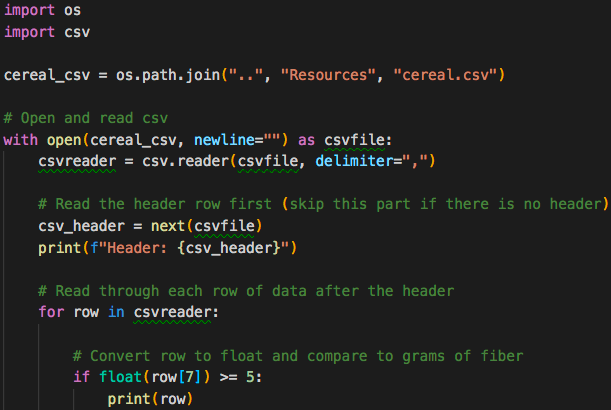
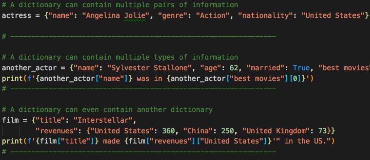
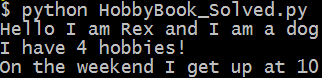
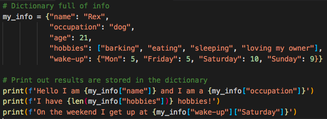
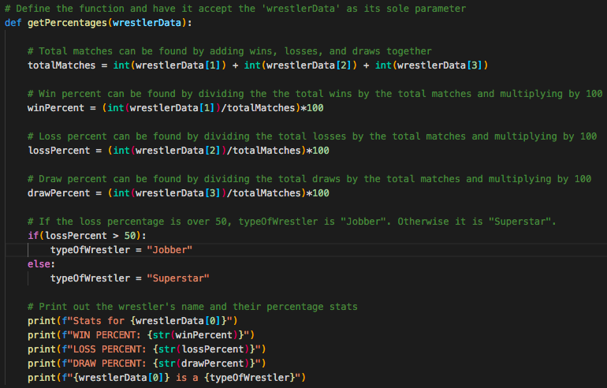
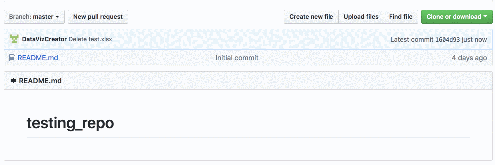

## 3.3 Lesson Plan - Python Deeper Dive

### Overview

Today's class will dive deeper into some of Python's other capabilities that will used throughout the rest of the course. The class will end with students learning Git from the command line.

### Instructor Notes

* The first part of today's class will continue to move along with Python, starting with a warm up exercises then moving into dictionaries, list comprehensions and functions.

* Some students may still be struggling with the pace and concepts of Python, make sure TAs are circulating and giving extra attention to the students who need it. If class is moving ahead of schedule there may be extra time for students to either tackle some additional attached problems, or serve as a review for those that are struggling.

* The last part of class will finish with Git and Github from the command line. Make sure students are comfortable creating repos, adding, committing, and pushing files up. This will be how they will use Github from now on and will continue to submit homework up to bootcamp spot.

### Sample Class Video (Highly Recommended)

* To view an example class lecture visit (Note video may not reflect latest lesson plan): [Class Video](https://codingbootcamp.hosted.panopto.com/Panopto/Pages/Viewer.aspx?id=fb86bd34-a59b-4850-87d8-6891c7445726)

- - -

### Class Objectives

* Students will be able to add, commit, and push code up to GitHub from the command line.

* Students will be able to create and use Python dictionaries.

* Students will be able to read data in from a dictionary.

* Students will be able to use list comprehensions.

* Students will be able to write and re use Python function.

* Students will have a firm understanding of coding logic and reasoning.

- - -

### 1. Instructor Do: Welcome Students (0:05)

* Welcome students to class and let them know today's class will dive deeper into more of Python's capabilities. Today's class will also finish with more usage of Git and Github, particularly how to use the command line to add and commit files.

### 2. Students Do: Cereal Cleaner (0:20)

* To start today's class off, students will be creating an application that reads in cereal data from a CSV and then prints only those cereals that have more than 5 grams of fiber in them.

* Open up [01-CerealCleaner](Activities/01-Stu_CerealCleaner/Solved/cereal_bonus_solved.py) within the terminal and run the code to show the end results of the application.

  

* **Files**

  * [cereal.csv](Activities/01-Stu_CerealCleaner/Resources/cereal.csv)

  * [cereal_bonus.csv](Activities/01-Stu_CerealCleaner/Resources/cereal_bonus.csv)

* **Instructions**

  * Read through `cereal.csv` and find the cereals that contain five grams of fiber or more, printing the data from those rows to the terminal.

* **Hint**

  * Everything within the csv is stored as a string and certain rows have a decimal. This means that they will have to be cast to be used.

  * The csv.Reader begins reading the csv file at the first row. Explain that `next(csv_reader, None)` will skip the header row.

  * Integers in Python are whole numbers and, as such, cannot contain decimals. As such, your numbers containing decimal points will have to be cast as a `float` or `double`.

* **Bonus**

  * Try the following again but this time using `cereal_bonus.csv`, which does not include a header.

### 3. Instructor Do: Review Cereal Cleaner (0:05)

* Open [cereal_solved.py](Activities/01-Stu_CerealCleaner/Solved/cereal_solved.py) and walk through the code with the class, answering whatever questions students have.

* Key points to cover when discussing this activity:

  * The importing of dependencies is done before anything else in the code. This is done to keep the code clean and makes it easier to read/understand in the future.

  * Point out how the variable `cereal_csv_path` is named in a very self-explanatory way. This is to ensure that future developers - including those who originally wrote this application - know precisely what referencing this variable means.

  * The same is true of `csv_reader` which is used to hold the data read in from the CSV file.

  * The `next()` function is placed before the `for` loop to skip over the first row of data - the header.

    

  * In order to check through all of the rows in the CSV file and find those that have more than five grams of fiber in them, a `for` loop containing an `if` statement is used.

  * Looking through the CSV file, one would find that the `fiber` column is stored within the 8th column. This means that, within the `if` statement, the values stored at index 7 must be checked.

* Check with the class to see what methods they used to come up with their solutions to the code before moving onto the next activity.

### 4. Instructor Do: Dictionaries (0:05)

* Another data type that is commonly used in Python is that of the dictionary.

  * Like lists and tuples, dictionaries can contain multiple values and types of data within them.

  * Unlike lists and tuples, however, dictionaries store data in key-value pairs. The key in a dictionary is a string that can be referenced in order to collect the value it is associated with.

* Open up [dictionaries.py](Activities/02-Ins_Dicts/Solved/dictionaries.py) and explain the code that is contained within. Make sure to explain the following:

  * A pair of curly braces is used to create a dictionary: `variable = {}`

  * Values can be added to dictionaries at declaration by creating a key that is stored within a string, following it with a colon, and then placing the value desired afterwards.

  * Referencing a value within a dictionary is as simple as calling the dictionary and following it up with a pair of brackets containing the key for the value desired.

    

  * Dictionaries can hold multiple pieces of information by following up each key-value pairing with a comma and then placing another key-value pair afterwards.

  * Dictionaries can also store lists. They can be accessed by first calling the key and then indexing the list. Assure students they only need a basic understanding of this for now and that when they get into APIs they will get a lot more practice.

  * Dictionaries can also contain other dictionaries. In order to access the values inside nested dictionaries, simply add another key to the reference.

    

  * It is important to note how dictionaries in Python will always auto-sort alphabetically. This means that the order in which key-value pairs were declared many not be the order they would be when printed in the console.

### 5. Students Do: Hobby-Book (0:15)

* Next the students will get practice with creating and accessing their own dictionaries based upon their hobbies.

* Open up [03-HobbyBook](Activities/03-Stu_HobbyBook/Solved/HobbyBook_Solved.py) within the terminal and run the code to show the end results of the application.

  

* **Instructions:**

  * Create a dictionary that will store the following:

    * Your name
    * Your age
    * A list of a few of your hobbies
    * A dictionary of a few times you wake up during the week

  * Print out your name, how many hobbies you have and a time you get up during the week.

### 6. Instructor Do: Review Hobby-Book (0:05)

* Open up [03-HobbyBook](Activities/03-Stu_HobbyBook/Solved/HobbyBook_Solved.py)  and walk through the code, making sure to explain the following:

  * A variable called `my_info` stores the primary dictionary as noted by the curly braces.

  * The keys are "name", "occupation", "age", "hobbies" and "wake-up". Their values are what is stored after the colons with each new key-value pair being separated by a comma.

  * In order to find the number of values stored within the "hobbies" key, the `len()` function is used.

    

### 7. Instructor Do: List Comprehensions (0:10)

* Explain we will be covering a powerful feature of the Python language called **list comprehensions**.

* Remind students that we used `for` loops to iterate through a list, and perform some action for each element.

  * We might, for instance, individually print out each of a user's favorite foods.

* Open [comprehensions.py](Activities/04-Evr_List_Comprehensions/Solved/comprehensions.py) and live code and walk through the different aspects of the code.

* Explain the example with the `fish` variable.

  * Explain that we can treat `fish` like an array, and use a list comprehension to turn it into a list of its constituent letters.

* Explain that we can then use this list of letters to create a new list of capitalized letters, by using a comprehension and calling `upper` on each letter.

* Finally, step through the temperature example.

* Explain that we can filter data in addition to changing it.

  * Explain how adding conditional logic, such as `if statements`, to a list comprehension allows us to select a certain value or range of values.

* Emphasize that this example is just intended to expose students to the flexibility and power of list comprehensions.

* Take a moment to answer any remaining questions before slacking out the example files.

### 8. Students Do: List Comprehensions (0:10)

* In this activity, you will use list comprehensions to compose a wedding invitation to send to every name on your mailing list.

* **Instructions**:

  * Open the file called `comprehensions.py`.

  * Create a list that prompts the user for the names of five people they know.

  * Run the provided program. Note that nothing forces you to write the name "properly"—e.g., as "Jane" instead of "jAnE". You will use list comprehensions to fix this.

    * First, use list comprehensions to create a new list that contains the lowercase version of each of the names your user provided.

    * Then, use list comprehensions to create a new list that contains the title=cased versions of each of the names in your lower-cased list.

* **Bonuses**

  * Instead of creating a lower-cased list and _then_ a title-cased list, create the title-cased list in a single comprehension.

* **Hints**

  * See the documentation for the [title](https://docs.python.org/3/library/stdtypes.html#str.title) method.

### 9. Instructor Do: Review Activity (0:08)

* Open [comprehensions.py](Activities/05-Stu_List_Comprehensions/Solved/comprehensions.py).

* Explain that the first code block simply declares a list to store names in, and then collects five names from the user.

* Ask a student to explain how to generate a list of lower-cased names.

  * Explain that we can use a list comprehension that calls `lower` on each name in the  list.

* Ask a student to explain how to generate a list of title-cased names.

  * Explain that we can use a list comprehension that calls `title` on each name in the  list.

* Ask a student to explain how to build the greeting for each sanitized string.

  * Explain that we can inject each name in `title-cased` into a format string.

  * Explain that, if we wanted to build a more complicated string, we would have to use a function, which we'll cover later in today's lesson.

* Finally, explain that we simply use a `for` loop to print every invitation in the `invitations` list.

  * Explain that we use a `for` loop instead of a list comprehension because we are _not_ using `title-cased` to create a new list—rather, we are simply performing an action for each item in `title-cased`.

* Take a moment to answer any remaining questions before slacking out the solution and moving on.

### 10. Everyone Do: Functions (0:15)

* **Files**:

  * [functions.py](Activities/06-Evr_Functions/Solved/functions.py)

* Explain the [DRY](https://en.wikipedia.org/wiki/Don%27t_repeat_yourself) concept to students and that we use functions and modules to avoid repeating code.

  * Ask a student (or: the class) if there are any disadvantages to writing code that does the same thing in three different places.

  * Explain that, if we write the same code in different places, and expect it to behave the same everywhere, we have to update it in several places whenever we make a change.

  * Point out that this can become unwieldy quickly: In large code-bases, copying code in multiple places would often require us to waste time making the _same_ change in several places, _and_ add the extra overhead of forcing us to keep track of duplicated code.

  * This is the motivation for the mantra of **D**on't **R**epeat **Y**ourself, or DRY.

* Live code and walk through the different function examples in `functions.py`.

* Show the basic anatomy of a function:

  ```python
  def name(parameters):
    # code goes here
    return
  ```

  * Explain that we use the keyword `def` to define a function, that `foo` is the name of the function, and that the parentheses that follow also indicate that `foo` is a function. Also bring to your students attention the colon at the end of the line.

  * Run the function in the console to demonstrate.

* Remind students that functions are a way for us to give a name to a set of instructions we want to be able to repeat.

* Point out that we use block indentation for the function body.

* Point out that we can pass data to functions through parameters and arguments.

* Walk through this code:

  ```python
   def show(message):
     print(message)
  ```

  * Explain that `message` is the data that we give the function, with which it _does_ something.

  * Explain that we first **defined** the function, but did not **run** it, in much the same way that having the blueprint of a house is not the same thing as living inside one.

  * Explain that we actually **run** the function with the following code:
    ```python
    show("Hello, World!")
    ```
  * Explain that calling a function is a synonym for running it. So when we say we call a function, it simply means that we are running, or executing, it.

* Ask a student to articulate the relationship between `message` (in the function declaration) and "Hello, World!" (in the function call).

  * Explain that a **parameter** is the name of a variable in a function while an **argument** is the value that you pass to the parameter.

* Explain that parameters allow us to run that set of instructions on _different_ inputs, which is what allows us to get different outputs.

* To carry the recipe analogy further, consider a recipe for quesadillas. Show and demonstrate the `make_quesadilla()` function in the code. Parts of the recipe are _always_ the same (they are the "function body"), but we can choose to make the recipe with, for instance, either chicken _or_ beef (our "arguments").

  * Warn students that arguments are positional and position matters! `make_quesadilla("sour cream", "beef")` will return `"Here is a sour cream quesadilla with beef"`.

* Explain that we can make parameters optional if we specify a default parameter. Go over the following code to illustrate this point:

  ```python
  def make_quesadilla(protein, topping="sour cream"):
    quesadilla = f"Here is a {protein} quesadilla with {topping}"
    print(quesadilla)
  ```

  * Explain that `topping="sour cream"` makes "sour cream" our default `topping`. That is, if no topping is specified as an argument when the function is called, the function will supply "sour cream" as the `topping`. Demonstrate what happens when we call the `make_quesadilla` function without a `topping` as an argument, as well as what happens when the function is called with a specific `topping` argument:

    * `make_quesadilla("chicken")`
    * `make_quesadilla("beef", "guacamole")`


* Explain that we can return data with the return statement:

  ```python
  def square(number):
    return number * number
  ```

  * Ask a student to explain the features of this function.

  * Point out that we often calculate values inside of functions.

  * Explain that, to get that value back when the function is done, we use the `return` keyword. In this case, it returns the `squared value`.

* Explain that we can save the returned value. Run, or have a student explain, the following line of code:

  ```python
  squared = square(2)
  print(squared)
  ```

* Explain that we can print the return value of a function also.

  ```python
  print(square(2))
  print(square(3))
  ```

### 11. Students Do: Functions (0:10)

* **Files**:

  * [Unsolved/main.py](Activities/07-Stu_Functions/Unsolved/main.py)

* **Instructions**:

  * Write a function called `average` that accepts a list of numbers.

    * The function `average` should return the arithmetic [mean](https://en.wikipedia.org/wiki/Arithmetic_mean) (average) for a list of numbers.

  * Test your function by calling it with different values and printing the results.

* **Hints**

  * [Arithmetic Mean (Average)](https://en.wikipedia.org/wiki/Arithmetic_mean)

### 12. Everyone Do: Review Activity (0:05)

* Open [Solved/main.py](Activities/07-Stu_Functions/Solved/main.py) and walk through the solution.

* Explain that we define a function called `average` that accepts a single parameter called **numbers**.

* Point out that we can define variables inside of the function body that are typically only used inside of the function. `length = len(numbers)`

* Explain that we could have created another variable called `average` and returned that variable, but we can actually just return the results from `sum / length`.

  * Explain that `sum / length` is first evaluated and then that value is returned.

* Explain that we want to test our code by calling the function with test data and printing the results.


### 13. Partners Do: Wrestling With Functions (0:15)

* Within the world of wrestling, there are winners and there are losers. Winners are labeled as "Superstars" while the losers receive the lowly title of "Jobber". Using a function, create the code necessary to search through a list of wrestlers, determine their win, loss, and draw percentages.


* After opening up the [08-Par_WrestlingWithFunctions/wrestling_functions.py](Activities/08-Par_WrestlingWithFunctions/Solved/wrestling_functions.py) of this activity in order to show students how their application should function, slack out the following files and instructions.

* **Files:**

  * [08-Par_WrestlingWithFunctions/wrestling_functions.py](Activities/08-Par_WrestlingWithFunctions/Unsolved/wrestling_functions.py)

  * [WWE-Data-2016.csv](Activities/08-Par_WrestlingWithFunctions/Resources/WWE-Data-2016.csv)

* **Instructions:**

  * Analyze the code and CSV provided, looking specifically for what needs to still be added to the application.

    * Explain that `header = next(reader)` will read the header row from the csv file.

  * Using the starter code provided, create a function called `getPercentages` which takes in a parameter called `wrestlerData` and does the following:

    * Uses the data stored within `wrestlerData` to calculate the percentage of matches the wrestler won, lost, and drew over the course of a year.

    * Prints out the stats for the wrestler to the terminal.

* **Bonus:**

  * Still within the `getPercentages()` function, create a conditional that checks a wrestler's loss percentage and prints either "Jobber" to the screen if the number was greater than fifty or "Superstar" if the number was less than 50.

### 14. Everyone Do: Wrestling With Functions Review (0:05)

* Open and slack out the file [08-Par_WrestlingWithFunctions/wrestling_functions.py](Activities/08-Par_WrestlingWithFunctions/Solved/wrestling_functions.py) from the previous activity and go over the code line by line with the class, answering whatever questions they may have.

* Key points to cover in this activity:

  * Looking through the CSV data beforehand was key to figuring out how to calculate the total number of matches wrestled. Doing so would have told students what each index within a row referred to.

  * Even though `row` is the variable being passed into the function, `wrestlerData` is still used within the function itself. The data within `row` is essentially moved into `wrestlerData` for usage within the function.

  

- - -

### 15. BREAK (0:40)

- - -

### 16. Instructor Do: Intro to Git (0:30)

* Explain to students that so far GitHub has really only been used as a sort of drop box to store our files. Although GitHub works well this way, it has far greater capability. Today there will be a deeper dive into what Git is and how to use it through the terminal to interact with Github.

* **N.b.**: If teaching with VS Code, consider using the [Git History](https://marketplace.visualstudio.com/items?itemName=donjayamanne.githistory) extension to illustrate this section's concents.


* Open [Intro_to_Git](Resources/Intro_to_Git.pptx) to go over slides 1-22. Explain that Git is essentially a way for us to keep track of our work over time.

  * Explain that, whenever we get another piece of a project working, we can save the change with Git.

  * Explain that this "save" is called a **commit**, and represents a "checkpoint" for our project.


* Explain that, if we break something in our code while developing, this system allows us to restore the working code from before.

* Explain that, since Git remembers these "checkpoints", we can work on several different concerns all at once.

  * Suppose we need to analyze Uber ride data for our project.

  * Explain that we might decide to analyze the average age of riders. Git essentially allows us to write this code, and save it with the name: `age analysis`.

* Emphasize that this code is _different_ from the code we started with, and that it lives separately from it.

  * Explain that, in this scenario, we have a version of the code, called `master`, which is the "main" version of our code; and a version, called `age analysis`, which contains updates.

* Explain that each version of the code lives on a different **branch**.

  * Explain that a **branch** is essentially a history of changes.

  * Explain that, in this case, we say that the `age analysis` branch **diverged** from the `master` branch.

  * Take a moment to demonstrate the difference between the files on the `age_analysis` and `master` branches.

* Explain that saving the age analysis code in a different branch gives our teammates a chance to review it for errors and offer suggestions.

* After the proposed change has been reviewed, we can update `master` branch to include the changes in `age analysis` by doing a **merge**.

* Explain that **merging** two branches turns them into one.

* Explain that this is how we can work on new features or bugfixes without making changes to code we know is working.

  * Explain that this also makes easy to work with teammates, as people can avoid stepping on each others' toes by working on different branches.

* Finally, take a moment to review Git's "Snapshot model":

> "...Git thinks of its data more like a set of snapshots of a miniature filesystem. Every time you commit, or save the state of your project in Git, it basically takes a picture of what all your files look like at that moment and stores a reference to that snapshot. To be efficient, if files have not changed, Git doesn’t store the file again, just a link to the previous identical file it has already stored. Git thinks about its data more like a stream of snapshots."


### 17. Everyone Do: Adding Files from the Command Line (0:10)

* Tell students that so far they have only added files using the GitHub website, which works well when just dealing with one or two files. What happens when multiple files need to be quickly added?

  * The command line comes to the rescue!

* Have students follow along with creating a repo and adding files with Terminal/Git-Bash.

  * Create a new repo.

  * From repo page, click the green box in the top right "Clone or download", select "Use SSH" and copy the link to the clipboard.

  

  * Open terminal (or git-bash for Windows users) and navigate to the home folder using `cd ~`.

  * Type in `git clone <repository link>` in the terminal to clone the repo to the current directory. Once this has run, everyone should now see a folder with the same name as the repo.

    

  * Open the folder in VS Code and create two python script files named `script01.py` and `script02.py`.

  * Once the files have been created, open up Terminal/git-bash and navigate to the repo folder. Run the following lines and explain each as you go through them.

  ```bash
  # Displays that status of files in the folder
  git status

  # Adds all the files into a staging area
  git add .

  # Check that thr files were added correctly
  git status

  # Commits all the files to your repo and adds a message
  git commit -m <add commit message here>

  # Pushes the changes up to GitHub
  git push origin master
  ```

  * Finally navigate to the repo on [Github.com](https://github.com/) to see that the changes have been pushed up.

* Make sure every student was able to successfully clone a repo, add file to the repo, commit the changes, and then push the changes to Github all from the command line.

### 18. Students Do: Adding more to the repo (0:15)

* **Instructions**

  * Using the repo that just created, make or add the following changes:

    * Add new lines of code to one of the python files.
    * Create a new folder.
    * Add a file to the newly created folder.
    * Add, commit and push the changes.
    * Delete the new folder.
    * Add, commit and push the changes again.

### 19. Instructor Do: Review Git (0:10)

* Ask students for any questions students may have and take a few minutes to review any commands which weren't clear. Offer to help students with this throughout the day and during office hours.

* Explain to students that this will be the new, primary way of submitting homework to GitHub (no more manual uploads!).

* Reassure them that it's ok if this take some time to figure out. By the end of the course, they will be git ninjas!

* Encourage students to continue to add and commit their activities today into a repo for additional practice.

### 20. Instructor Do: Video Guide and Close Class (0:02)

* Before finishing up for the night, slack out the [Video Guide](../VideoGuide.md) containing walkthroughs of this week's key activities. Encourage students to review them later and utilize office hours if they have further questions.

### Extra Do: Additional exercises

* If class finishes ahead of schedule let students know that there are some additional challenging exercises to work for those that are ready. For students that still have question there will be time to get additional help from TA's and the instructor.

* Supplemental exercises:

  * [ADVANCED_Ins_Set_Operations](Extra_Content/ADVANCED_Ins_Set_Operations)

  * [ADVANCED_Stu_Resume_Analysis](Extra_Content/ADVANCED_Stu_Resume_Analysis)

  * [ADVANCED_Stu_UUID_Generator](Extra_Content/ADVANCED_Stu_UUID_Generator)

  * [Stu_Email](Extra_Content/Stu_Email)

- - -

### LessonPlan & Slideshow Instructor Feedback

* Please click the link which best represents your overall feeling regarding today's class. It will link you to a form which allows you to submit additional (optional) feedback.

* [:heart_eyes: Great](https://www.surveygizmo.com/s3/4381674/DataViz-Instructor-Feedback?section=python-day-3&lp_useful=great)

* [:grinning: Like](https://www.surveygizmo.com/s3/4381674/DataViz-Instructor-Feedback?section=python-day-3&lp_useful=like)

* [:neutral_face: Neutral](https://www.surveygizmo.com/s3/4381674/DataViz-Instructor-Feedback?section=python-day-3&lp_useful=neutral)

* [:confounded: Dislike](https://www.surveygizmo.com/s3/4381674/DataViz-Instructor-Feedback?section=python-day-3&lp_useful=dislike)

* [:triumph: Not Great](https://www.surveygizmo.com/s3/4381674/DataViz-Instructor-Feedback?section=python-day-3&lp_useful=not%great)

- - -

### Copyright

Trilogy Education Services © 2018. All Rights Reserved.
