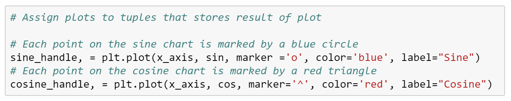
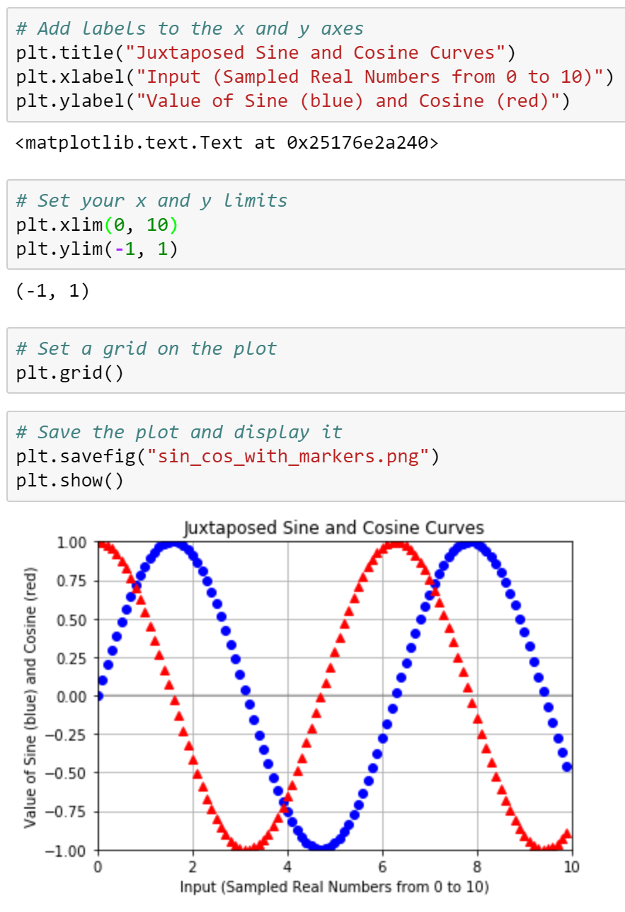

## 5.1 Lesson Plan - Introduction to Matplotlib

### Overview

Today's class will introduce students to the basics of [Matplotlib](http://Matplotlib.org/), one of the most popular Python plotting libraries in use today.

### Instructor Priorities

* Students will understand Matplotlib's pyplot interface.

* Students will be able to create line; bar; scatter; and pie charts.

* Students will be familiar with basic plot configuration options, such as `xlim` and `ylim`.

### Instructor Notes

* A note on potential errors caused by the Matplotlib library:

  * `%matplotlib notebook` is used in a number of activities. It not only makes a plot interactive, but it also allows it to be updated after the initial plot. If students encounter weirdness during the activities, check to see that they use this line before importing the plotting libraries.

  * Ideally, students should update their Matplotlib to version 2.2 or newer. A known bug with earlier version resizes plots after exporting an image with the `savefig` method.

* The solutions to most of today's activities are fairly simple. The instructor should approach each exercise by presenting the expected output; briefly discussing the code used to generate it; and sharing the final image, but withholding the example code until the activity review.

  * This is to encourage students to develop the habit of exploring the Matplotlib documentation. A large part of the process of developing plots with the library is reading [examples](http://Matplotlib.org/examples/index.html), so it is important for them to become accustomed to this workflow.

* Have your TAs refer to the [Time Tracker](TimeTracker.xlsx) to stay on track.

### Sample Class Video (Highly Recommended)

* To view an example class lecture visit (Note video may not reflect latest lesson plan): [Class Video](https://codingbootcamp.hosted.panopto.com/Panopto/Pages/Viewer.aspx?id=ec176c10-1f37-4547-8e89-0e598aa6d66a)

- - -

### Class Objectives

* Students should understand Matplotlib's pyplot interface.

* Students should be able to create line, bar, scatter, and pie charts.

* Students should be able to change the appearance of their plots.

- - -

### 1. Instructor Do: Introduction to Matplotlib (0:10)

* Explain that today's class will introduce students to Matplotlib, one of the most popular Python charting libraries in use.

  * Today's lesson will focus in particular on familiarizing students with the basics of a module called PyPlot, which they can use to create simple charts quickly.

* Slack out the [Student Guide](../StudentGuide.md) class objectives and useful links that students can refer to during this week's activities.

* Open and run [01-Ins_BasicLineGraphs/ExponentialChart.ipynb](Activities/01-Ins_BasicLineGraphs/Solved/exponential_chart.ipynb) within Jupyter Notebook to show students how PyPlot can be used to create an exponential line graph.

  * The NumPy library is oftentimes used alongside PyPlot. This package contains plenty of built-in methods which allow for simple scientific computing.

  * Explain that `np.arange(start, end, step)` creates a list of numbers from `start` to `end`, where each number in the list is `step` away from the next ones.

  * Make sure to point out how the `e_x` list is being created using a "list comprehension". List comprehensions allow lists to be created using mathematic formulae. For example, the one being used in this application, takes values from the `x_axis` list one at a time, finds the exponential of them, and stores the response within a list.

    

  * Explain that Matplotlib allows users to generate plots by setting one list as the x-axis and another as the y-axis. It really is as simple as calling `plt.plot()`, passing those two lists through as parameters, and then calling `plt.show()` afterwards to print the chart to the screen.

  * Matplotlib handles the details of painting charts to the screen, but the programmer has full control over each stage of the drawing process if they really need it. By using `plt.xlabel()` and `plt.ylabel`, for example, users can easily add axis titles to their charts as well.

    

* Open and run [01-Ins_BasicLineGraphs/SinCos.ipynb](Activities/01-Ins_BasicLineGraphs/Solved/sin_cos.ipynb) within Jupyter Notebook to show students how PyPlot can be used to create a plot with multiple lines as well.

  * Point out how `np.arange()`, `np.sin()`, and `np.cos()` are all being used in order to create the lists for the application's charts.

  * In order to chart multiple lines on the same chart, it is as simple as calling `plt.plot()` two times and providing PyPlot with different values.

    

  * Reassure students that, while this plot is very simple, it introduces all of the major tools required to build much "prettier" plots in the future.

* Remind students that visualizations of data are valuable for far more than aesthetics. Trends and "human" insights buried within complex data sets are often clearest when the data is visualized in some way.

  * Open the [Bay Area Weather blog post](https://blog.plon.io/tutorials/weather-data-for-san-francisco-bay-area-a-python-pandas-and-matplotlib-tutorial/), or just the [image](Images/01-temperature.png) and point out that the trend is clear from the graphic but would _not_ be obvious in a table.

    

### 2. Students Do: New Jersey Weather (0:15)

* Students will now attempt to create a series of line plots using temperature data from New Jersey.

* Open up [02-Stu_NJTemp/Solved/NJ_temp.ipynb](Activities/02-Stu_NJTemp/Solved/NJ_temp.ipynb) within the Jupyter Notebook and run the code to show the end results of the application.

* **Instructions:**

  * Using the following data, plot the monthly averages for temperature in New Jersey.

    * Use the numeric value for months.

    * Average temperature per month in Fahrenheit: `[39, 42, 51, 62, 72, 82, 86, 84, 77, 65, 55, 44]`

  * Use list comprehension to convert the temperature to Celsius and plot that line as well.

  * Create a third plot that includes both lines.

* **Hints:**

  * The formula to convert Fahrenheit to Celsius: `(x-32) * 0.56`

  * See the [MatPlotLib Documentation](https://matplotlib.org/2.0.2/index.html) for more information regarding the PyPlot library

  * Also look into the [NumPy Documentation](https://docs.scipy.org/doc/numpy-dev/reference/) for more information on the NumPy library

### 3. Instructor Do: Review New Jersey Weather (0:05)

* Open up [02-Stu_NJTemp/nj_temp.ipynb](Activities/02-Stu_NJTemp/Solved/NJ_temp.ipynb) within the Jupyter Notebook and go through the code line-by-line with the class, answering whatever questions they may have.

  * A list of numbers ranging from one to twelve are created using `np.arange(1,13,1)`. The parameters passed tell NumPy to start at one, finish before thirteen, and each value should be one greater than the last.

  * In order to create the Fahrenheit chart, simply pass the `x_axis` and `points` lists into `plt.plot()` and then run `plt.show()`

    

  * To convert the values within the `points` list to Celsius, use a list comprehension where each value in the initial list is passed through the following formula: `(x-32) * 0.56`

    

  * Showing both lines on a single chart is as simple as running the code for drawing both of the charts within the same cell and then using the `plt.show()` method.

### 4. Instructor Do: Configuring Line Plots (0:10)

* Point out that Matplotlib's basic line plots are rather bland.

  * Thankfully Matplotlib offers considerable control over the details of our plots' appearances and the easiest way to change the way things look is to use **keyword arguments** to configure the behavior of `plot`.

* Slack out the updated sin and cosine example titled [03-Ins_ConfiguringLinePlots/line_config.ipynb](Activities/03-Ins_ConfiguringLinePlots/Solved/line_config.ipynb) and open up the code within Jupyter Notebook.

  * Point out that, while not massively different aesthetically, this new version of the Sin/Cos plot does introduce some additional components.

  * `plt.hlines()` is used to draw a horizontal line. This method takes in three parameters: the Y value across which the line will be drawn, the X value where the line will start, and the X value where the line will end.

  * The transparency of the horizontal line can also be set using the `alpha=` keyword and passing a number between 0 and 1. This setting is possible with most MatplotLib plotting functions.

    

* Draw attention to the lines being drawn and set to `sin_handle,` and `cos_handle,` and explain:

  * `pyplot.plot` returns a list of the lines that were added to the plot.

  * This bit of code is using argument unpacking to select only the first line from that list of lines.

  * So, calling the `sine_handle` is a reference to the lines object.

  * `plt.plot()` can take in more parameters than just the X and Y values for the line being charted. For example, the markers for a plot can be set using `marker=`, the color of a plot can be set using `color=`, and the label for a line can be set using `label=`.

    

  * The `plt.legend()` method allows the user to create a legend for their chart. The `loc` argument is used to set the location of the legend on the chart.

  * While the `plt.show()` command has not changed, a new line called `plt.savefig()` has been added which will save a version of the chart to an external file. Simply pass the file path desired as a parameter to save the image.

    

* Explain that the different [markers](http://Matplotlib.org/api/markers_api.html) and [colors](http://Matplotlib.org/api/colors_api.html) are available in the documentation, which students are encouraged to peruse when building their plots.

### 5. Students Do: Legendary Temperature (0:15)

* Students will now edit the line plots they created earlier so that these charts are more visually interesting.

* Encourage students to play with additional configuration options beyond those asked for. Slack out links to the Matplotlib API so that students can play around with the library when they finish the activity.

* Open up [avg_temp.png](Activities/04-Stu_LegendaryTemperature/Images/avg_temp.png) so that the class can see what chart they will be attempting to create.

  

* **Files:**

  * [02-Stu_NJTemp/nj_temp.ipynb](Activities/02-Stu_NJTemp/Solved/NJ_temp.ipynb)

  * [avg_temp.png](Activities/04-Stu_LegendaryTemperature/Images/avg_temp.png)

* **Instructions:**

  * Modify the New Jersey temperature line charts from earlier so that they match the image provided.

  * Once the plot has been created, look through the [MatPlotLib Documentation](https://matplotlib.org/2.0.2/index.html) to see what additional formatting could be added to the chart.

### 6. Instructor Do: Review Legendary Temperature (0:03)

* Open up [04-Stu_LegendaryTemperature/legendary_temp.ipynb](Activities/04-Stu_LegendaryTemperature/Solved/legendary_temp.ipynb) within the Jupyter Notebook and go through the code line-by-line with the class, answering whatever questions they may have.

  * Make sure to discuss how both `fahrenheit` and `celsius` are followed by commas to set them as tuples. This is crucial since `plt.legend()` expects to be handed tuples within its `handles` parameter and would return an error otherwise.

  * The `loc` parameter of `plt.legend()` has been set to "best" within this application. This allows MatplotLib to decide where to place the legend so that it does not get in the way.

    

* Check with the class to see what interesting formatting options they uncovered during this activity and ask a couple of them to come up and explain their code to the class.

### 7. Instructor Do: Aesthetics (0:05)

* Point out that the best plots, like the best code, are easy to read. Emphasize that this is different from being beautiful. Graphics need not be "artistic," but they should be easy to understand.

* Explain that some ways to improve readability include:

  * Adding labels to the x-axis

  * Adding labels to the y-axis

  * Adding titles to plots

  * Limiting the extent of the plot to bound the plot's data points

  * In some cases adding grids can also help but this is often discouraged in general

* Explain that adding labels ensures the graphic remains honest and easy to understand, even in cases where the visualization is not immediately transparent to most viewers — such as with, for example, [Sankey diagrams](https://en.wikipedia.org/wiki/Sankey_diagram).

* Explain that limiting the extent of the plot maximizes the [data-to-ink ratio](http://www.infovis-wiki.net/index.php/Data-Ink_Ratio), and constrains the plot to display only relevant information.

* Open up the [updated sine and cosine plot](Activities/05-Ins_Aesthetics/Images/sin_cos_with_markers.png).

  * Point out that this is not yet "attractive," but is more readable than the previous plots, thanks to the labels and changes being made to the x-axis.

  * `plt.xlabel()`, `plt.ylabel()`, and `plt.title()` are fairly self-explanatory. Simply pass a string into them as a parameter and the labels and title will be drawn onto the chart.

  * `plt.xlim()` and `plt.ylim()` are used to set where the axes for the chart should begin/end. MatplotLib will naturally create charts with a lot of empty space and these methods can help to limit that.

  * `plt.grid()` is also fairly obvious. Through its usage, gridlines are added to the chart.

    

### 8	Students Do: Coaster Speed (0:10)

* Students will now create a line chart that graphs the speed of a roller coaster over time. They will then style the chart and add some aesthetics to it.

* Open up [06-Stu_RollerCoaster/coaster_speed.ipynb](Activities/06-Stu_RollerCoaster/Solved/coaster_speed.ipynb) so that the class can see what chart they will be attempting to create.

  

* **Files:**

  * [Coaster Speed Chart](Activities/06-Stu_RollerCoaster/Images/CoasterSpeed.png)

* **Instructions:**

  * Create a line chart with two plots using the following data:

    * `Danger Drop: [9, 8, 90, 85, 80, 70, 70, 65, 55, 60, 70, 65, 50]`

    * `RailGun: [75, 70, 60, 65, 60, 45, 55, 50, 40, 40, 35, 35, 30]`

  * Both coasters are 120 seconds long and the speed was measured every 10 seconds.

  * Apply styling and labels that match the image provided.

### 9	Instructor Do: Coaster Speed Review (0:05)

* Open up [06-Stu_RollerCoaster/coaster_speed.ipynb](Activities/06-Stu_RollerCoaster/Solved/coaster_speed.ipynb) within the Jupyter Notebook and go through the code line-by-line with the class, answering whatever questions they may have.

  * `plt.title()`, `plt.xlabel()`, and `plt.ylabel()` are used to set the title and axis labels.

  * The `plt.xlim()` and `plt.ylim()` are set so that there is as little empty space as possible on the chart whilst still making it understandable.

    

- - -

### 10	BREAK	(0:15)

- - -

### 11. Instructor Do: Different Plots (0:03)

* Point out that Matplotlib provides a simple interface for producing more than line plots.

* Explain that the most common charts students will generate are line charts, bar charts, pie charts, and scatter plots.

  * Explain that **bar charts** are useful for comparing different entities to one another.

  * Explain that **pie charts** are suitable for displaying parts of a whole — in particular, to what extent different constituents of a whole contribute to that whole.

  * Explain that **scatter plots** are good for displaying where points fall with respect to two different factors.

* Emphasize the importance of choosing the right plot for a given data set.

  * Remind students that the wrong choice can make the graphic less readable or may even make the data misleading.

  * Point out that some data might lend itself to different plots — some data can be reasonably displayed via bar or pie chart, for instance.

### 12. Instructor Do: Bar Charts (0:05)

* Open the bar chart example within Jupyter Notebook: [07-Ins_BarCharts/bar_chart.ipynb](Activities/07-Ins_BarCharts/Solved/bar_chart.ipynb)

  * Explain that, when dealing with bar charts, it is necessary to provide the heights of each bar within an array.

  * The x-axis will also be an array whose length must equal that of the list of heights.

  * Instead of using `plt.plot()` bar charts are drawn using `plt.bar()`.

  * The `align` parameter for `plt.bar()` is center to center.

    

  * Explain that an additional aesthetic challenge unique to bar charts is aligning the tick locations on the x-axis and providing textual, rather than numeric, labels.

  * The `tick_locations` list created within this application places a tick for each `value` in the `x_axis`.

    

  * The `plt.xlim()` and `plt.ylim()` are set so that there is some space between the bars and the edge of the chart. This makes the chart look a little better aesthetically.

### 13. Students Do: Bars Bar Chart (0:10)

* The class will now take some time to create a bar chart that visualizes the density of bars within major US cities.

* Open up [08-Stu_PyBars/py_bars.ipynb](Activities/08-Stu_PyBars/Solved/py_bars.ipynb) so that the class can see what chart they will be attempting to create.

  

* **Files:**

  * [08-Stu_PyBars/py_bars.ipynb](Activities/08-Stu_PyBars/Unsolved/py_bars.ipynb)

  * [Bars Bar Chart](Activities/08-Stu_PyBars/Images/BarDensity.png)

* **Instructions:**

  * Using the file provided as a starter, create a bar chart that matches the image provided.

### 14. Everyone Do: Bars Bar Chart Review (0:04)

* Open up [08-Stu_PyBars/py_bars.ipynb](Activities/08-Stu_PyBars/Solved/py_bars.ipynb) within the Jupyter Notebook and go through the code line-by-line with the class, answering whatever questions they may have.

  * Focus in upon the ticks set for the bar chart in particular.

  * `plt.xlim()` is set to go from -0.75 to the length of the Y axes minus 0.25 so that there is a degree of space between the leftmost bar and the edge of the chart.

    

### 15. Instructor Do: Pie Charts (0:05)

* Open the pie chart example: [09-Ins_PieCharts/pie_chart.ipynb](Activities/09-Ins_PieCharts/Solved/pie_chart.ipynb)

  * Explain that the sizes of each wedge are passed into `plt.pie()` as an array. Lists containing the labels for each wedge and the colors for each wedge are also passed in.

  * Point out that the pie chart allows the user to choose a wedge to "explode," using the `explode` option. This will separate one wedge from the rest so that it is easier to examine.

  * Inside of the `plt.pie()` method, a parameter of `autopc="%1.1%%"` is being passed. This will automatically convert the values passed into percentages with one decimal place.

    

  * Explain that Matplotlib does not constrain pie charts to be circular — by default, they will be ovals if the window the plot lives in is not a square. This is why `plt.axis("equal")` is being passed.

    

  * Explain that there are additional configuration options available for improving the appearance of Matplotlib's pie charts should students desire to look into them.

### 16. Students Do: Pies Pie Chart (0:10)

* The class will now take some time to create a pie chart that visualizes the favorite pies within the United States.

* Open up [10-Stu_PyPies/py_pie.ipynb](Activities/10-Stu_PyPies/Solved/py_pie.ipynb) so that the class can see what chart they will be attempting to create.

  

* **Files:**

  * [10-Stu_PyPies/py_pie.ipynb](Activities/10-Stu_PyPies/Unsolved/py_pie.ipynb)

  * [Pies Pie Chart](Activities/10-Stu_PyPies/Images/PyPies.png)

* **Instructions:**

  * Using the file provided as a starter, create a pie chart that matches the image provided.

### 17. Everyone Do: Pies Pie Chart Review (0:05)

* Open up [10-Stu_PyPies/py_pie.ipynb](Activities/10-Stu_PyPies/Solved/py_pie.ipynb) within the Jupyter Notebook and go through the code line-by-line with the class, answering whatever questions they may have.

  * One of the things that makes this activity challenging is knowing what colors are available for use. Students can find a list of colors available to peruse [here](https://matplotlib.org/users/colors.html)

  * Pie charts are VERY easy to make since the editing of a chart only really requires the editing of values. The styling and aesthetics other than this are fairly uniform across charts.

    

### 18. Instructor Do: Scatter Plots (0:10)

* Finally, open the scatter plot example: [11-Ins_ScatterPlots/scatter_plot.ipynb](Activities/11-Ins_ScatterPlots/Solved/scatter_plot.ipynb)

  * Explain that this plot uses random data just so the class can avoid cluttering the example with Pandas cleanup — later activities will provide more realistic context.

  * Explain that generating scatter plots demands the simplest set of methods of all the charts so far. Simply take in two sets of data and pass them into `plt.scatter()`.

  * Call attention to the fact that the code can change the size of each dot by passing the `s=<LIST>` parameter. In this case, the values stored within `x_axis` will determine the size of a dot.

    

### 19. Students Do: Scatter Py (0:10)

* The class will now take some time to create a scatter plot that visualizes ice cream sales in comparison to temperature increases.

* Open up [12-Stu_ScatterPy/ice_cream_sales.ipynb](Activities/12-Stu_ScatterPy/Solved/ice_cream_sales.ipynb) so that the class can see what chart they will be attempting to create.

  

* **Files:**

  * [12-Stu_ScatterPy/ice_cream_sales.ipynb](Activities/12-Stu_ScatterPy/Unsolved/ice_cream_sales.ipynb)

  * [IceCreamSales Chart](Activities/12-Stu_ScatterPy/Images/IceCreamSales.png)

* **Instructions:**

  * Using the file provided as a starter, create a scatter plot that matches the image provided.

* **Bonus**

  * Create a new list called "scoop_price," fill it with values, and then set it so that the size of the dots are set according to those values.

### 20. Everyone Do: Scatter Py Review (0:05)

* Open up [12-Stu_ScatterPy/ice_cream_sales.ipynb](Activities/12-Stu_ScatterPy/Solved/ice_cream_sales.ipynb) within the Jupyter Notebook and go through the code line-by-line with the class, answering whatever questions they may have.

### 21. Students Do: Average Rainfall (0:15)

* Students will now attempt to create a bar chart which shows the average rainfall in different states by importing data in from a CSV file. This will require them to think outside the box and try using Pandas alongside MatplotLib.

* Open up [13-Stu_AvgRain/avg_state_rain.ipynb](Activities/13-Stu_AvgRain/Solved/avg_state_rain.ipynb) so that the class can see what chart they will be attempting to create.

  

* **Files:**

  * [avg_rain_state.csv](Activities/13-Stu_AvgRain/Resources/avg_rain_state.csv)

  * [avg_state_rain.ipynb](Activities/13-Stu_AvgRain/Unsolved/avg_state_rain.ipynb)

  * [avg_state_rain.png](Activities/13-Stu_AvgRain/Images/avg_state_rain.png)

* **Instructions:**

  * Using the resources provided, create a bar graph that matches that of the image provided.

### 22. Everyone Do: Average Rainfall Review (0:05)

* Open up [13-Stu_AvgRain/avg_state_rain.ipynb](Activities/13-Stu_AvgRain/Solved/avg_state_rain.ipynb) within the Jupyter Notebook and go through the code line-by-line with the class, answering whatever questions they may have.

- - -

### LessonPlan & Slideshow Instructor Feedback

* Please click the link which best represents your overall feeling regarding today's class. It will link you to a form which allows you to submit additional (optional) feedback.

* [:heart_eyes: Great](https://www.surveygizmo.com/s3/4381674/DataViz-Instructor-Feedback?section=matplotlib-day-1&lp_useful=great)

* [:grinning: Like](https://www.surveygizmo.com/s3/4381674/DataViz-Instructor-Feedback?section=matplotlib-day-1&lp_useful=like)

* [:neutral_face: Neutral](https://www.surveygizmo.com/s3/4381674/DataViz-Instructor-Feedback?section=matplotlib-day-1&lp_useful=neutral)

* [:confounded: Dislike](https://www.surveygizmo.com/s3/4381674/DataViz-Instructor-Feedback?section=matplotlib-day-1&lp_useful=dislike)

* [:triumph: Not Great](https://www.surveygizmo.com/s3/4381674/DataViz-Instructor-Feedback?section=matplotlib-day-1&lp_useful=not%great)

- - -

### Copyright

Trilogy Education Services © 2019. All Rights Reserved.
